# Planner Engine — Arquitectura Cognitiva

> **Documento de arquitectura para el Planner Engine de EREN.**
> Define cómo el Planner transforma intenciones en planes ejecutables.
> Complementa el [Clinical Reasoning Framework](./clinical-reasoning-framework.md).

| | |
|---|---|
| **Estado** | Arquitectura definida (scaffolding) |
| **Fase** | Cognitiva — Fase 2 |
| **Tipo** | Motor cognitivo (core engine) |
| **Alineado con** | Clinical Reasoning Framework §3, ADR-0002, ADR-0006 |
| **No contiene** | Lógica de negocio, IA, ejecución de pasos |

---

## Índice

- [1. Propósito](#1-propósito)
  - [1.1 Qué es el Planner](#11-qué-es-el-planner)
  - [1.2 Qué NO es el Planner](#12-qué-no-es-el-planner)
  - [1.3 Posición en la arquitectura](#13-posición-en-la-arquitectura)
- [2. Responsabilidades](#2-responsabilidades)
  - [2.1 Las cuatro responsabilidades](#21-las-cuatro-responsabilidades)
  - [2.2 Límites de responsabilidad](#22-límites-de-responsabilidad)
- [3. Arquitectura](#3-arquitectura)
  - [3.1 Pipeline de transformación](#31-pipeline-de-transformación)
  - [3.2 Modelo de datos](#32-modelo-de-datos)
  - [3.3 Estrategia de inyección](#33-estrategia-de-inyección)
  - [3.4 Flujo de ejecución](#34-flujo-de-ejecución)
- [4. Comportamiento del Planner](#4-comportamiento-del-planner)
  - [4.1 Recepción de intención](#41-recepción-de-intención)
  - [4.2 Creación de plan](#42-creación-de-plan)
  - [4.3 Selección de motores](#43-selección-de-motores)
  - [4.4 Ordenamiento de ejecución](#44-ordenamiento-de-ejecución)
- [5. Modelo de Incertidumbre](#5-modelo-de-incertidumbre)
  - [5.1 Cuando el Planner no puede planificar](#51-cuando-el-planner-no-puede-planificar)
  - [5.2 Niveles de confianza del plan](#52-niveles-de-confianza-del-plan)
- [6. Integración con Motores](#6-integración-con-motores)
  - [6.1 Flujo Orchestrator → Planner](#61-flujo-orchestrator--planner)
  - [6.2 Relación con Clinical Framework](#62-relación-con-clinical-framework)
  - [6.3 Mapa de responsabilidades](#63-mapa-de-responsabilidades)
- [7. Casos de Uso](#7-casos-de-uso)
  - [7.1 Revisión de monitor de signos vitales](#71-revisión-de-monitor-de-signos-vitales)
  - [7.2 Diagnóstico de bomba de infusión](#72-diagnóstico-de-bomba-de-infusión)
  - [7.3 Mantenimiento de ventilador](#73-mantenimiento-de-ventilador)
- [8. Evolución Futura](#8-evolución-futura)
  - [8.1 Estrategias avanzadas](#81-estrategias-avanzadas)
  - [8.2 Métricas de calidad](#82-métricas-de-calidad)
- [Apéndice A. Referencias](#apéndice-a-referencias)

---

## 1. Propósito

### 1.1 Qué es el Planner

El **Planner** es el motor cognitivo responsable de transformar una **intención del usuario** en un **plan de ejecución** compuesto por pasos ordenados y asignados a motores cognitivos específicos.

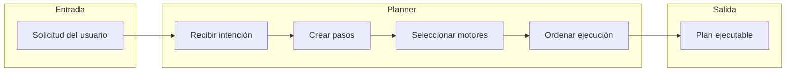

El Planner es el **"cerebro ejecutivo"** de EREN: no ejecuta nada, pero decide qué debe hacerse y en qué orden.

### 1.2 Qué NO es el Planner

| NO hace | Por qué |
|---------|---------|
| Ejecutar pasos | Eso es responsabilidad del Orchestrator / Workflow Engine |
| Razonar dentro de un paso | Eso es responsabilidad del Reasoning Engine |
| Conectar con BD/Supabase | Eso es responsabilidad de los motores de datos |
| Generar respuestas finales | Eso es responsabilidad del Orchestrator + Voice Engine |
| Usar LLMs directamente | Eso es responsabilidad de los motores que lo necesiten |

### 1.3 Posición en la arquitectura

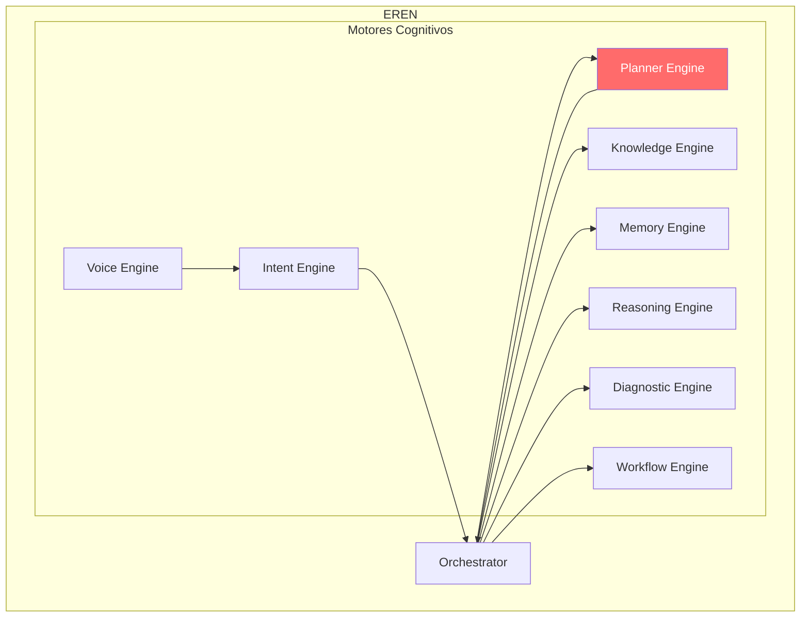

El Planner ocupa la posición central entre el **Orchestrator** (que le envía solicitudes) y los **demás motores cognitivos** (a los que asigna trabajo).

---

## 2. Responsabilidades

### 2.1 Las cuatro responsabilidades

| # | Responsabilidad | Método | Descripción |
|---|----------------|--------|-------------|
| 1 | **Recibir intención** | `_receive_intention()` | Normalizar solicitud cruda en `Intention` estructurada |
| 2 | **Crear plan** | `_create_plan()` | Descomponer intención en pasos candidatos |
| 3 | **Seleccionar motores** | `_select_engines()` | Asignar motor cognitivo a cada paso |
| 4 | **Ordenar ejecución** | `_order_execution()` | Resolver dependencias en orden topológico |

### 2.2 Límites de responsabilidad

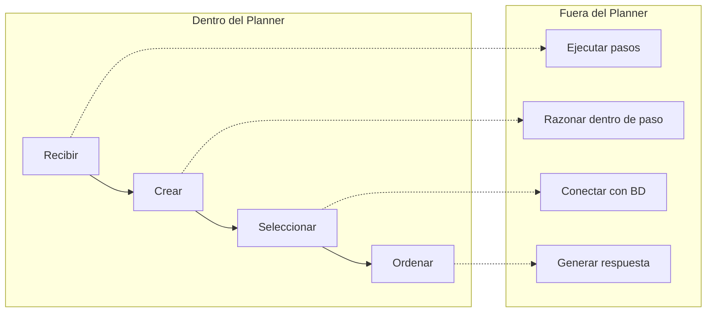

---

## 3. Arquitectura

### 3.1 Pipeline de transformación

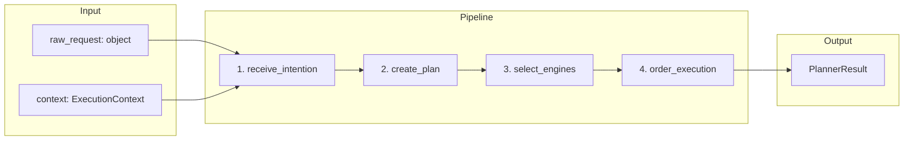

### 3.2 Modelo de datos

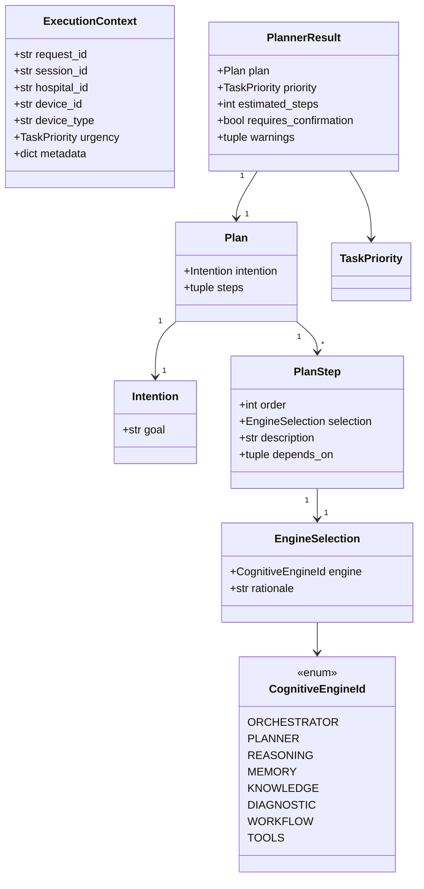

### 3.3 Estrategia de inyección

El Planner utiliza **inyección de dependencias** para permitir evolución sin modificar el código base:

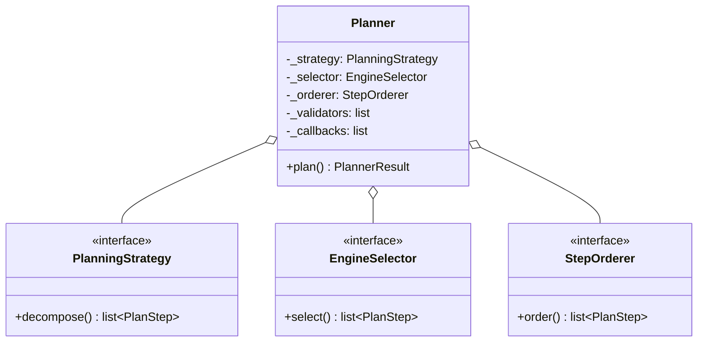

**Estrategias por defecto incluidas:**
- `_DefaultPlanningStrategy`: Descomposición basada en palabras clave
- `_DefaultEngineSelector`: Selección estática por tipo de paso
- `_DefaultStepOrderer`: Ordenamiento topológico (Kahn)

### 3.4 Flujo de ejecución

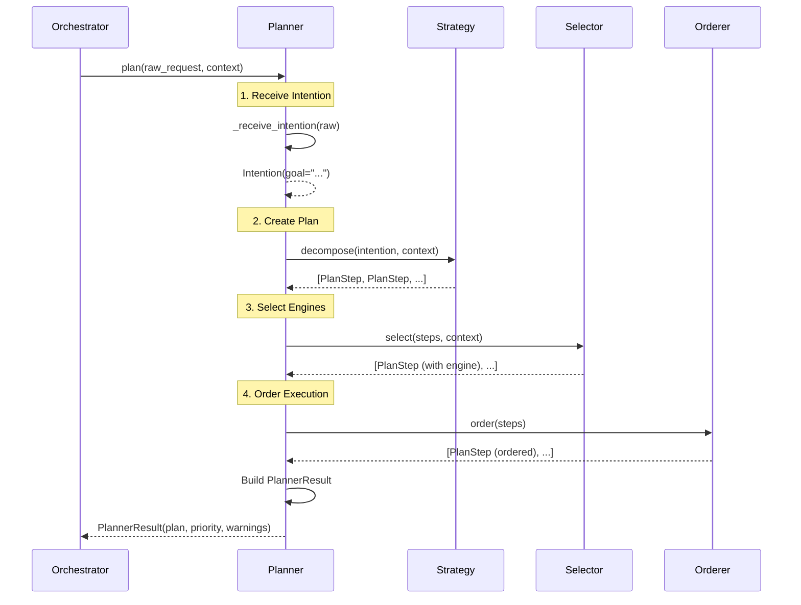

---

## 4. Comportamiento del Planner

### 4.1 Recepción de intención

**Entrada:** `raw_request: object`
**Salida:** `Intention`

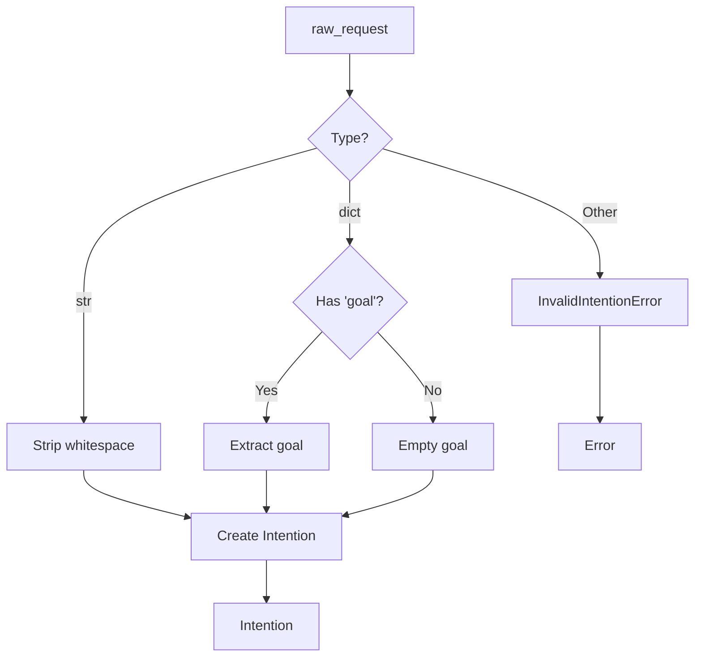

**Reglas:**
- Strings → normalizados directamente
- Dicts con `goal` → extraído el valor
- Otros tipos → `InvalidIntentionError`
- Goals vacíos → `InvalidIntentionError`

### 4.2 Creación de plan

**Entrada:** `Intention`, `ExecutionContext`
**Salida:** `list[PlanStep]`

El Planner delega a la `PlanningStrategy` configurada:

```
Intención → Strategy.decompose() → [PlanStep candidatos] → [PlanStep validados]
```

**Estrategia por defecto:**
- Detecta palabras clave en el goal
- Genera pasos basados en patrones (diagnostic, maintenance, regulatory)
- Usa el contexto para enriquecer los pasos

### 4.3 Selección de motores

**Entrada:** `list[PlanStep]`, `ExecutionContext`
**Salida:** `list[PlanStep]` (con `selection` poblado)

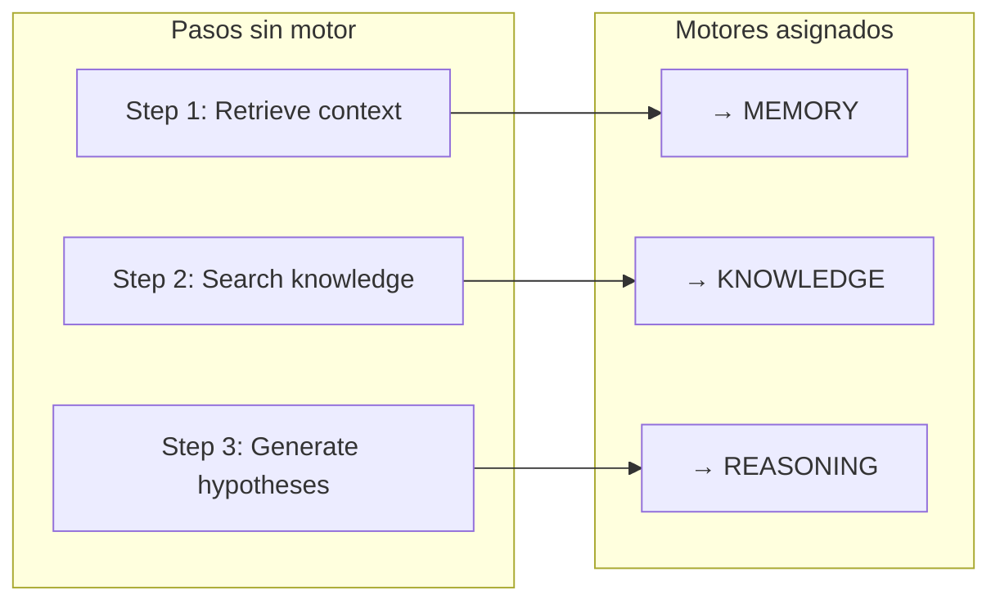

### 4.4 Ordenamiento de ejecución

**Entrada:** `list[PlanStep]`
**Salida:** `Plan`

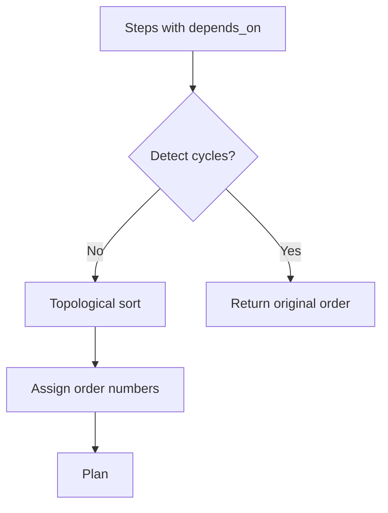

**Algoritmo por defecto:** Kahn's algorithm para ordenamiento topológico.

---

## 5. Modelo de Incertidumbre

### 5.1 Cuando el Planner no puede planificar

| Situación | Comportamiento |
|-----------|----------------|
| Input vacío | `InvalidIntentionError` |
| Estrategia falla | `PlanCreationError` |
| Motor no disponible | `EngineSelectionError` |
| Dependencias cíclicas | `StepOrderingError` (devuelve orden original) |

### 5.2 Niveles de confianza del plan

El `PlannerResult` incluye un campo `warnings` para indicar incertidumbre:

| Tipo de warning | Causa |
|-----------------|-------|
| `"No steps generated"` | La estrategia no produjo pasos |
| `"Critical plan with many steps"` | Plan crítico con >5 pasos |
| `"Requires confirmation"` | Plan necesita validación humana |

---

## 6. Integración con Motores

### 6.1 Flujo Orchestrator → Planner

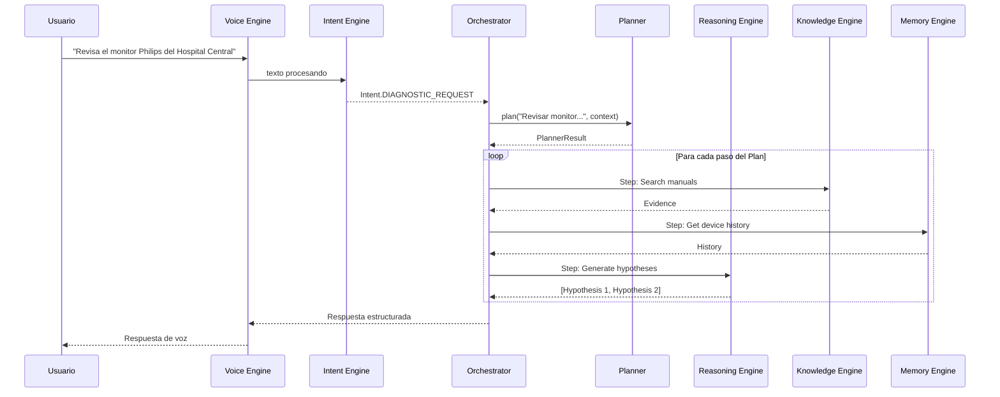

### 6.2 Relación con Clinical Framework

El Planner implementa el **Ciclo Cognitivo de EREN** (§3 del Clinical Reasoning Framework):

| Paso del Ciclo Cognitivo | Responsabilidad del Planner |
|--------------------------|----------------------------|
| Solicitud del usuario | Recepción por Voice/Intent Engine |
| **Comprensión de la intención** | `_receive_intention()` |
| **Construcción del contexto** | `ExecutionContext` + validators |
| **Creación de un plan** | `_create_plan()` |
| **Selección de herramientas/motores** | `_select_engines()` |
| Obtención de evidencia | Delegado a Knowledge/Memory |
| Generación de hipótesis | Delegado a Reasoning Engine |
| **Construcción de la respuesta** | Orchestrator + Voice Engine |

### 6.3 Mapa de responsabilidades

| Motor | Responsabilidad con el Planner |
|-------|-------------------------------|
| **Orchestrator** | Llama a `Planner.plan()`, ejecuta el Plan resultante |
| **Voice Engine** | Captura la solicitud del usuario (entrada al Planner) |
| **Intent Engine** | Proporciona la intención normalizada |
| **Knowledge Engine** | Provee evidencia para los pasos del plan |
| **Memory Engine** | Provee historial y contexto para el plan |
| **Reasoning Engine** | Ejecuta los pasos de razonamiento del plan |
| **Diagnostic Engine** | Evalúa severidad y riesgo para priorización |
| **Workflow Engine** | Gestiona planes largos que abarcan múltiples sesiones |

---

## 7. Casos de Uso

### 7.1 Revisión de monitor de signos vitales

**Solicitud:** *"EREN, revisa el monitor Philips MX450 del Hospital Central."*

**Plan generado:**

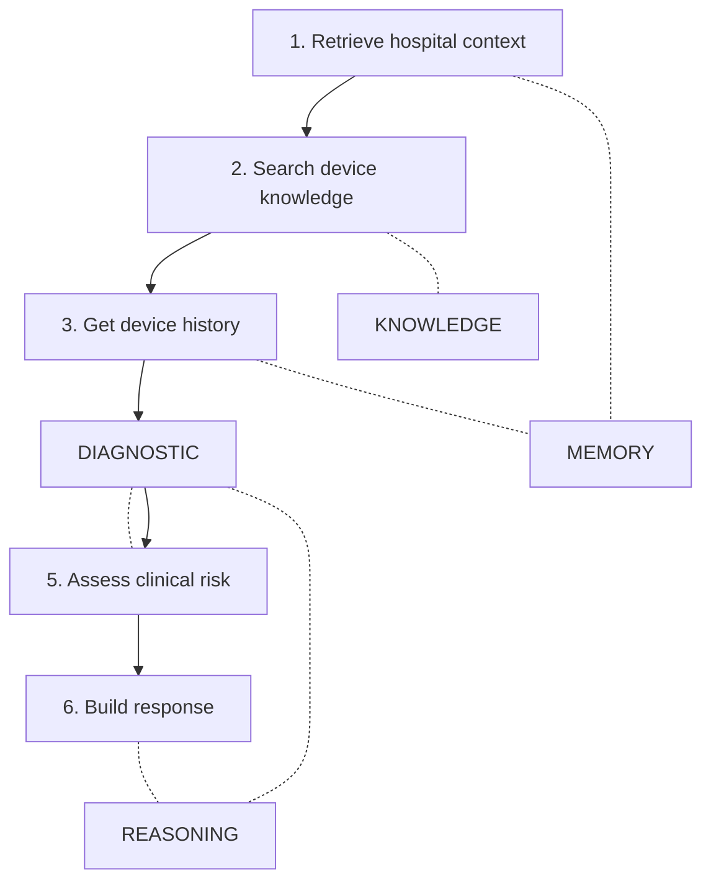

### 7.2 Diagnóstico de bomba de infusión

**Solicitud:** *"El equipo muestra error E02 y no infunde."*

**Plan generado:**
1. Retrieve device context (MEMORY)
2. Search error E02 in manuals (KNOWLEDGE)
3. Check recent maintenance history (MEMORY)
4. Generate hypotheses: oclusión, aire, fallo bomba (REASONING)
5. Assess patient safety risk (DIAGNOSTIC)
6. Recommend verification steps (REASONING)

### 7.3 Mantenimiento de ventilador

**Solicitud:** *"Necesito hacer mantenimiento preventivo del ventilador Puritan Bennett 980."*

**Plan generado:**
1. Retrieve device specifications (KNOWLEDGE)
2. Get maintenance schedule (MEMORY)
3. Generate preventive maintenance checklist (REASONING)
4. Assess parts availability (DIAGNOSTIC)
5. Create maintenance workflow (WORKFLOW)

---

## 8. Evolución Futura

### 8.1 Estrategias avanzadas

| Capacidad futura | Estrategia | Impacto |
|-----------------|------------|---------|
| LLM-assisted planning | `LLMPlanningStrategy` | Reemplaza `_DefaultPlanningStrategy` |
| Learning from feedback | `LearnedEngineSelector` | Reemplaza `_DefaultEngineSelector` |
| Optimización de orden | `CostBasedOrderer` | Reemplaza `_DefaultStepOrderer` |
| Plan explanation | Add rationale to each step | Mejora traabilidad |

### 8.2 Métricas de calidad

| Métrica | Descripción | Objetivo |
|---------|-------------|----------|
| Plan accuracy | % de planes ejecutados sin replan | > 95% |
| Step precision | % de pasos necesarios | < 10% pasos innecesarios |
| Replan rate | Frecuencia de replanificación | < 5% |
| Latency | Tiempo de generación del plan | < 500ms |

---

## Apéndice A. Referencias

| Referencia | Ubicación |
|------------|-----------|
| Clinical Reasoning Framework | [./clinical-reasoning-framework.md](./clinical-reasoning-framework.md) |
| CORE README | [core/README.md](../core/README.md) |
| Planner contract | [core/contracts/planner.py](../../core/contracts/planner.py) |
| Intent Engine | [core/intent/README.md](../intent/README.md) |
| ADR-0001 (COS) | [adr/ADR-0001-cognitive-operating-system.md](../adr/ADR-0001-cognitive-operating-system.md) |
| ADR-0002 (CORE) | [adr/ADR-0002-eren-core-architecture.md](../adr/ADR-0002-eren-core-architecture.md) |
| ADR-0006 (Intent) | [adr/ADR-0006-intent-engine.md](../adr/ADR-0006-intent-engine.md) |

---

**Última actualización:** 2026-07-13  
**Estado:** Arquitectura definida (scaffolding)  
**Fase:** Cognitiva — Fase 2  
**Tipo:** Documentación arquitectónica