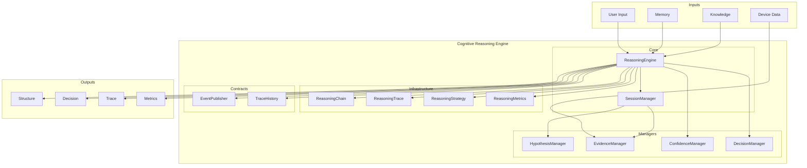
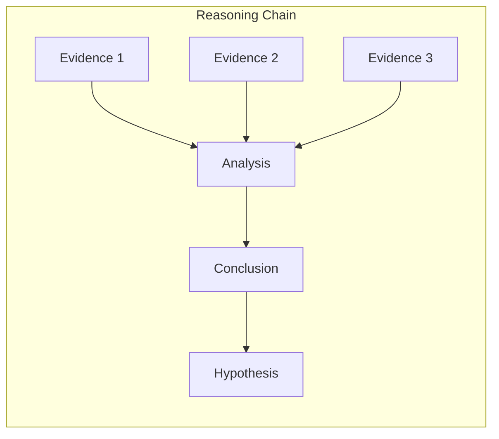
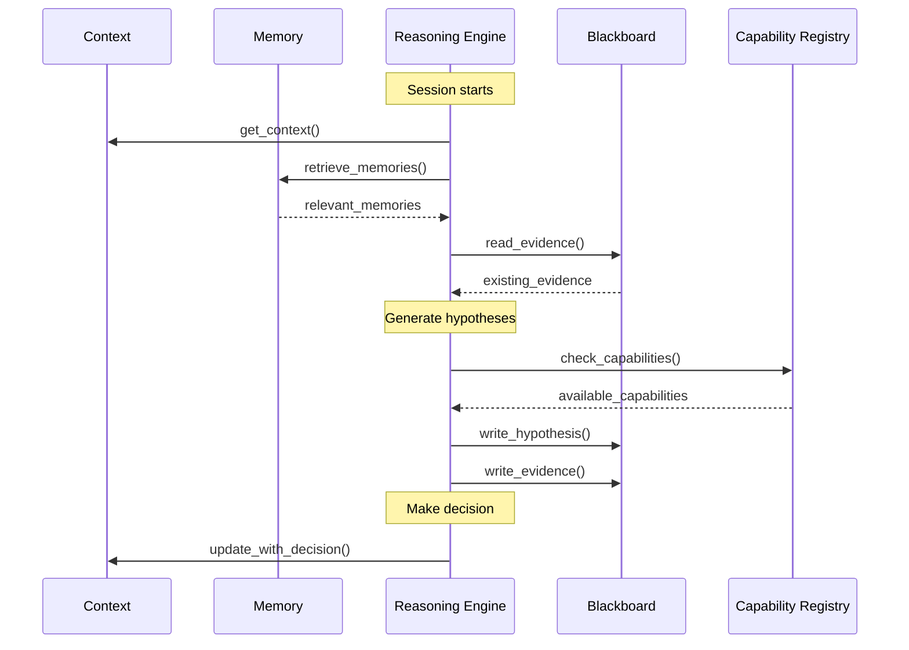

# Cognitive Reasoning Engine — Arquitectura

> **Documento de arquitectura para el Cognitive Reasoning Engine (CRE) de EREN.**
> El CRE es el cerebro logico de EREN.
> Complementa el [Clinical Reasoning Framework](./clinical-reasoning-framework.md).

| | |
|---|---|
| **Estado** | Implementacion completa |
| **Fase** | Cognitiva - Fase 2 |
| **Tipo** | Motor de razonamiento |
| **Paradigma** | EREN NO usa IA |
| **No contiene** | LLM, diagnostico, implementaciones reales |

---

## Indice

- [1. Mision](#1-mision)
- [2. Paradigma](#2-paradigma)
- [3. Arquitectura](#3-arquitectura)
- [4. Hipotesis](#4-hipotesis)
- [5. Evidencia](#5-evidencia)
- [6. Confianza](#6-confianza)
- [7. Decisiones](#7-decisiones)
- [8. Cadena de Razonamiento](#8-cadena-de-razonamiento)
- [9. Trazabilidad](#9-trazabilidad)
- [10. Estrategias](#10-estrategias)
- [11. Integracion](#11-integracion)
- [12. Eventos](#12-eventos)
- [13. Metricas](#13-metricas)

---

## 1. Mision

```
El Reasoning Engine transforma evidencia en hipotesis
y posteriormente en decisiones justificadas.

Nunca responde directamente al usuario.
Su unica salida es una estructura de razonamiento.
```

---

## 2. Paradigma

```
ANTIGUO: Chatbot con IA
=======================
Usuario -> Prompt -> LLM -> Respuesta
                        (No sabe como llego alla)

NUEVO: Cerebro Logico
=====================
Usuario -> Peticion
                |
                v
         +------------+
         |   CRE      |
         +------------+
                |
    +-----------+-----------+
    |           |           |
    v           v           v
+--------+ +--------+ +--------+
|Hipotesis| |Evidencia| |Decision|
+--------+ +--------+ +--------+
    |           |           |
    +-----------+-----------+
                |
                v
         +------------+
         |  Estructura|
         |  de        |
         |  Razonamiento|
         +------------+
```

---

## 3. Arquitectura



---

## 4. Hipotesis

### 4.1 Concepto

Una hipotesis es una explicacion potencial para una observacion.

```
+----------------------------------+
|         HIPOTESIS               |
+----------------------------------+
| hypothesis_id: "hyp_abc123"     |
| description: "Sensor SpO2 dano" |
| probability: 0.82               |
| status: SUPPORTED               |
+----------------------------------+
| supporting_evidence: [e1, e2]    |
| contradicting_evidence: []       |
| confidence: 0.85                 |
+----------------------------------+
```

### 4.2 Sistema de Hipotesis Multiples

```
Hipotesis (coexisten)
========

Hipotesis 1: Sensor SpO2 dano
  Probabilidad: 0.82
  Estado: SUPPORTED

Hipotesis 2: Cable roto
  Probabilidad: 0.61
  Estado: ACTIVE

Hipotesis 3: Configuracion incorrecta
  Probabilidad: 0.33
  Estado: ACTIVE

Hipotesis 4: Firmware
  Probabilidad: 0.11
  Estado: REJECTED
```

### 4.3 Ciclo de Vida

```
                    +----------+
         +--------->| ACTIVE   |<---------+
         |          +----+-----+          |
         |               |                |
    +----v-----+    +----v-----+    +----v-----+
    | SUPPORTED|    |CONTRADICT|    |  PENDING |
    +----+-----+    +----+------+    +----+-----+
         |               |                |
         |               |                |
    +----v-----+    +----v-----+    +----v-----+
    |CONFIRMED |    | REJECTED |    | ARCHIVED |
    +----------+    +----------+    +----------+
```

---

## 5. Evidencia

### 5.1 Tipos de Evidencia

| Tipo | Descripcion | Fuente |
|------|-------------|--------|
| OBSERVATION | Observacion directa | Usuario |
| MEASUREMENT | Medicion cuantitativa | Sensor |
| HISTORICAL | Datos historicos | Memoria |
| DOCUMENTED | De documentacion | Manual |
| REPORTED | Reportado por usuario | Usuario |
| DERIVED | Derivada de otra evidencia | Motor |

### 5.2 Relaciones

```
EVIDENCIA --relacion--> HIPOTESIS

+----------+    SUPPORTS    +----------+
|  ev_1    |--------------->|  hyp_1  |
| "Error   |               | "Sensor  |
|  E101"   |               |  dano"   |
+----------+               +----------+

+----------+   CONTRADICTS  +----------+
|  ev_2    |--------------->|  hyp_1  |
| "Todas   |               |          |
|  las     |               |          |
|  pruebas"|               |          |
+----------+               +----------+
```

### 5.3 Operaciones

| Operacion | Descripcion |
|------------|-------------|
| AGREGAR | Anadir evidencia |
| ELIMINAR | Remover evidencia |
| RELACIONAR | Conectar con hipotesis |
| CONTRADECIR | Marcar como contradiccion |
| CONFIRMAR | Marcar como confirmacion |
| DERIVAR | Crear evidencia derivada |

---

## 6. Confianza

### 6.1 Modelo Desacoplado

```
                  +---------------------+
                  |  ConfidenceCalculator |
                  +----------+----------+
                             |
        +--------------------+--------------------+
        |                    |                    |
        v                    v                    v
+----------------+  +----------------+  +----------------+
|    Default     |  |    Bayesian    |  | Dempster-Shafer|
+----------------+  +----------------+  +----------------+

Formula (Default):
P(H|E) = P(H) * (1 + sum(supporting) - sum(contradicting))
```

### 6.2 Niveles de Confianza

| Nivel | Valor | Descripcion |
|-------|-------|-------------|
| NONE | 0.0 | Sin confianza |
| VERY_LOW | 0.15 | Especulativo |
| LOW | 0.3 | Baja confianza |
| MODERATE | 0.5 | Confianza moderada |
| HIGH | 0.75 | Alta confianza |
| VERY_HIGH | 0.9 | Muy alta confianza |
| CERTAIN | 1.0 | Cierto |

---

## 7. Decisiones

### 7.1 Estructura de Decision

```python
@dataclass
class Decision:
    decision_id: str
    decision_type: DecisionType
    description: str
    based_on_hypothesis: str
    confidence: ConfidenceScore
    justification: tuple[str, ...]
    alternatives: tuple[str, ...]
    selected_reason: str
```

### 7.2 Tipos de Decision

| Tipo | Descripcion |
|------|-------------|
| DIAGNOSTIC | Decision de diagnostico |
| THERAPEUTIC | Decision de tratamiento |
| OPERATIONAL | Decision operacional |
| RECOMMENDATION | Recomendacion |

---

## 8. Cadena de Razonamiento



### 8.1 Tipos de Inferencia

| Tipo | Descripcion |
|------|-------------|
| DEDUCTIVE | General a especifico |
| INDUCTIVE | Especifico a general |
| ABDUCTIVE | Mejor explicacion |
| RULE_BASED | Aplicacion de reglas |
| CASE_BASED | Casos similares |
| CAUSAL | Causa-efecto |

---

## 9. Trazabilidad

### 9.1 Reasoning Trace

```
+------------------------------------------+
|           REASONING TRACE               |
+------------------------------------------+
| trace_id: "trace_abc123"               |
| session_id: "sess_xyz"                 |
+------------------------------------------+
| EVENTS                                  |
+------------------------------------------+
| - session_started                       |
| - hypothesis_created                    |
| - evidence_added                       |
| - evidence_incorporated                |
| - confidence_updated                   |
| - decision_generated                   |
| - session_completed                    |
+------------------------------------------+
| HYPOTHESIS GRAPH                        |
+------------------------------------------+
| Nodes: [hyp_1, hyp_2, hyp_3]          |
| Edges: [ev_1->hyp_1, ev_2->hyp_2]      |
+------------------------------------------+
| EVIDENCE GRAPH                          |
+------------------------------------------+
| Nodes: [ev_1, ev_2, ev_3]             |
| Edges: [ev_1->ev_3] (derived)          |
+------------------------------------------+
```

---

## 10. Estrategias

### 10.1 Estrategias Disponibles

| Estrategia | Descripcion |
|-----------|-------------|
| EXHAUSTIVE | Considera todas las hipotesis |
| FOCUSED | Solo las mas probables |
| EVIDENCE_FIRST | Recolecta evidencia primero |
| HYPOTHESIS_FIRST | Genera hipotesis primero |

### 10.2 Seleccion de Estrategia

```
                    +------------------+
                    |  Problema        |
                    +--------+---------+
                             |
          +------------------+------------------+
          |                  |                  |
    many hypotheses?    limited evidence?   time critical?
          |                  |                  |
          v                  v                  v
    +----------+      +-----------+      +----------+
    | EXHAUSTIVE|     |EVIDENCE_  |      | FOCUSED |
    |          |      |FIRST      |      |          |
    +----------+      +-----------+      +----------+
```

---

## 11. Integracion



---

## 12. Eventos

### 12.1 Tipos de Evento

| Evento | Descripcion |
|--------|-------------|
| session_started | Sesion iniciada |
| hypothesis_created | Hipotesis creada |
| evidence_added | Evidencia anadida |
| confidence_updated | Confianza actualizada |
| decision_generated | Decision generada |
| session_completed | Sesion completada |

---

## 13. Metricas

| Metrica | Descripcion |
|---------|-------------|
| hypotheses_generated | Numero de hipotesis generadas |
| hypotheses_confirmed | Numero de hipotesis confirmadas |
| evidence_collected | Evidencia recopilada |
| reasoning_steps | Pasos de razonamiento |
| average_confidence | Confianza promedio |
| total_reasoning_time | Tiempo total |

---

## Referencias

| Referencia | Ubicacion |
|------------|-----------|
| Clinical Reasoning Framework | [./clinical-reasoning-framework.md](./clinical-reasoning-framework.md) |
| CORE README | [core/README.md](../core/README.md) |

---

**Ultima actualizacion:** 2026-07-13  
**Estado:** Implementacion completa  
**Fase:** Cognitiva - Fase 2  
**Tipo:** Documentacion arquitectonica  
**Paradigma:** EREN NO usa IA