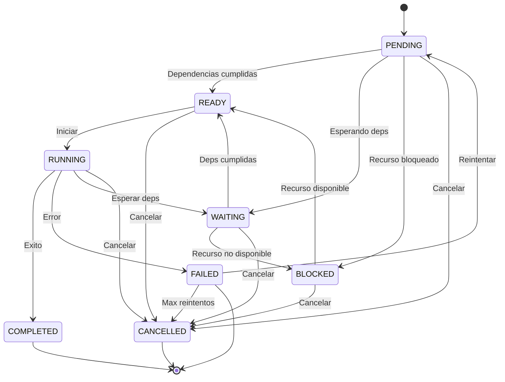
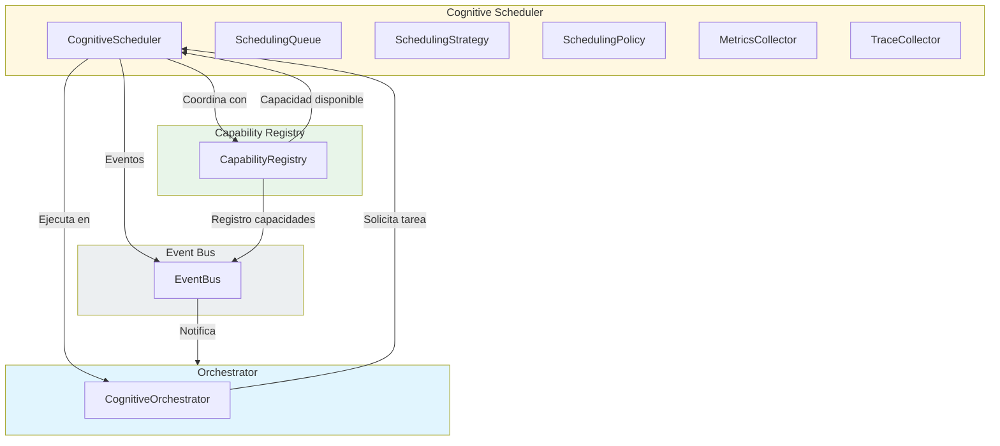
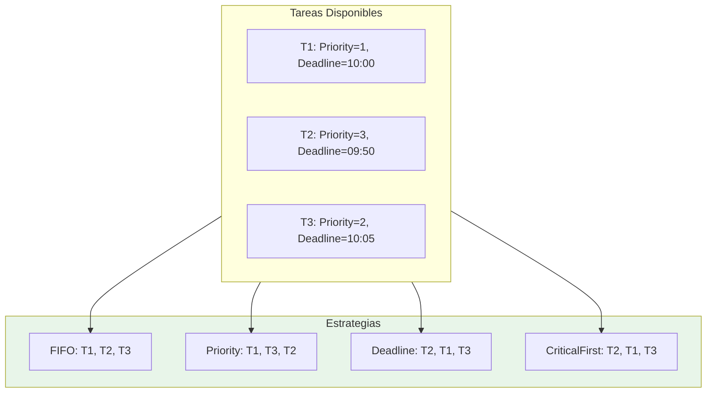

# Cognitive Scheduler — Arquitectura

> **Documento de arquitectura para el Cognitive Scheduler (CS) de EREN.**
> El Scheduler coordina la planificacion temporal del procesamiento cognitivo.

| | |
|---|---|
| **Estado** | Fundacion implementada |
| **Fase** | Cognitiva - Fase 2 |
| **Tipo** | Scheduler |
| **Paradigma** | EREN NO usa IA |

---

## Indice

- [1. Mision](#1-mision)
- [2. Filosofia](#2-filosofia)
- [3. Estados de Tarea](#3-estados-de-tarea)
- [4. Responsabilidades](#4-responsabilidades)
- [5. Integracion](#5-integracion)
- [6. Estrategias](#6-estrategias)
- [7. Politicas](#7-politicas)
- [8. Trazabilidad](#8-trazabilidad)
- [9. Roadmap](#9-roadmap)

---

## 1. Mision

```
El Cognitive Scheduler decide QUE capacidad cognitiva debe ejecutarse
en cada momento del ciclo.

NO ejecuta motores.
NO conoce implementaciones concretas.
NO toma decisiones de negocio.

Solo coordina la planificacion temporal.
```

---

## 2. Filosofia

```
Separacion clara:
================

Scheduler (ESTE componente)
---------------------------
- Decide cuando ejecutar tareas
- Gestiona colas de tareas
- Aplica estrategias de scheduling
- Enforce politicas

Motores (ejecutores)
---------------------------
- Planner: Planifica
- Knowledge: Consulta conocimiento
- Memory: Consulta memoria
- Reasoning: Razo
- Decision: Decide
- Tool: Ejecuta

Infraestructura (dependencias)
---------------------------
- Capability Registry: Registro de capacidades
- EventBus: Comunicacion
- Orchestrator: Coordinacion
```

---

## 3. Estados de Tarea

### 3.1 Diagrama de Estados



### 3.2 Estados Completos

| Estado | Descripcion |
|--------|-------------|
| PENDING | Tarea creada, esperando |
| READY | Tarea lista para ejecutar |
| RUNNING | Tarea en ejecucion |
| WAITING | Esperando dependencias |
| BLOCKED | Bloqueada por recurso |
| COMPLETED | Completada exitosamente |
| FAILED | Fallo |
| CANCELLED | Cancelada |

---

## 4. Responsabilidades

### 4.1 Lo Que Hace el Scheduler

```
╔═══════════════════════════════════════════════════════════════════════════════╗
║                      RESPONSABILIDADES DEL SCHEDULER                            ║
╠═══════════════════════════════════════════════════════════════════════════════╣
║                                                                             ║
║  1. GESTION DE COLAS                                                    ║
║     • Crear y gestionar colas                                             ║
║     • Enqueue/dequeue de tareas                                           ║
║     • Priorizacion de tareas                                             ║
║                                                                             ║
║  2. SELECCION DE TAREAS                                                ║
║     • Aplicar estrategia de scheduling                                   ║
║     • Seleccionar siguiente tarea                                        ║
║     • Considerar dependencias                                           ║
║                                                                             ║
║  3. COORDINACION DE CAPACIDADES                                        ║
║     • Verificar disponibilidad de capacidades                            ║
║     • Reservar capacidades                                              ║
║     • Liberar capacidades                                               ║
║                                                                             ║
║  4. APLICACION DE POLITICAS                                           ║
║     • Verificar timeouts                                                ║
║     • Limitar reintentos                                               ║
║     • Controlar capacidad                                               ║
║                                                                             ║
║  5. OBSERVABILIDAD                                                    ║
║     • Publicar eventos                                                  ║
║     • Recolectar metricas                                              ║
║     • Registrar traces                                                  ║
║                                                                             ║
╚═══════════════════════════════════════════════════════════════════════════════╝
```

### 4.2 Lo Que NO Hace el Scheduler

```
╔═══════════════════════════════════════════════════════════════════════════════╗
║                     RESTRICCIONES DEL SCHEDULER                             ║
╠═══════════════════════════════════════════════════════════════════════════════╣
║                                                                             ║
║  ✗ NO ejecuta tareas directamente                                        ║
║  ✗ NO conoce implementaciones de motores                                ║
║  ✗ NO toma decisiones de negocio                                       ║
║  ✗ NO accede a datos clinicos                                          ║
║  ✗ NO modifica contexto directamente                                    ║
║                                                                             ║
║  El Scheduler SOLO planifica. No hace.                                  ║
║                                                                             ║
╚═══════════════════════════════════════════════════════════════════════════════╝
```

---

## 5. Integracion

### 5.1 Diagrama de Integracion



### 5.2 Flujo de Planificacion

```
╔═══════════════════════════════════════════════════════════════════════════════╗
║                     FLUJO DE PLANIFICACION                                  ║
╠═══════════════════════════════════════════════════════════════════════════════╣
║                                                                             ║
║  1. Orchestrator necesita ejecutar capacidad                             ║
║     ↓                                                                   ║
║  2. Scheduler recibe peticion                                           ║
║     ↓                                                                   ║
║  3. Scheduler crea CognitiveTask                                        ║
║     ↓                                                                   ║
║  4. Task se encola en SchedulingQueue                                    ║
║     ↓                                                                   ║
║  5. Scheduler verifica disponibilidad de capacidad                      ║
║     ↓                                                                   ║
║  6. CapabilityRegistry responde                                         ║
║     ↓                                                                   ║
║  7. Scheduler aplica estrategia de scheduling                           ║
║     ↓                                                                   ║
║  8. Scheduler selecciona siguiente tarea                                ║
║     ↓                                                                   ║
║  9. Scheduler notifica a Orchestrator                                   ║
║     ↓                                                                   ║
║  10. Orchestrator inicia tarea en capacidad                             ║
║     ↓                                                                   ║
║  11. Scheduler actualiza estado de tarea                                ║
║     ↓                                                                   ║
║  12. Evento publicado para observabilidad                                ║
║                                                                             ║
╚═══════════════════════════════════════════════════════════════════════════════╝
```

---

## 6. Estrategias

### 6.1 Estrategias Disponibles

| Estrategia | Descripcion | Caso de Uso |
|------------|------------|-------------|
| FIFO | Primero en entrar, primero en salir | Orden de llegada |
| Priority | Prioridad mas alta primero | Tareas criticas |
| DeadlineFirst | Deadline mas cercano primero | Tiempo real |
| CriticalFirst | Critico + deadline + prioridad | Entornos criticos |
| FairScheduling | Distribucion equitativa | Multi-sesion |

### 6.2 Diagrama de Seleccion



---

## 7. Politicas

### 7.1 Politicas Disponibles

| Politica | Descripcion | Valor Predeterminado |
|----------|------------|---------------------|
| task_timeout_ms | Timeout de tarea | 30000 (30s) |
| max_retries | Maximo reintentos | 3 |
| max_concurrent_tasks | Maximo tareas concurrentes | 10 |
| max_tasks_per_capability | Maximo por capacidad | 5 |

### 7.2 Presets

```python
# Baja latencia
PolicyPresets.low_latency()

# Alto throughput
PolicyPresets.high_throughput()

# Critico
PolicyPresets.critical()
```

---

## 8. Trazabilidad

### 8.1 TraceEntry

```python
@dataclass
class SchedulingTraceEntry:
    entry_id: str           # ID unico
    task_id: str           # ID de tarea
    session_id: str       # ID de sesion
    correlation_id: str    # ID de correlacion
    timestamp: str        # Timestamp ISO
    action: str           # Accion
    task_state: str       # Estado de tarea
    capability: str      # Capacidad
    strategy_used: str    # Estrategia usada
```

### 8.2 Acciones Rastreables

| Accion | Descripcion |
|--------|------------|
| SUBMITTED | Tarea creada |
| SCHEDULED | Tarea seleccionada |
| STARTED | Tarea iniciada |
| COMPLETED | Tarea completada |
| FAILED | Tarea fallida |
| CANCELLED | Tarea cancelada |
| RETRY | Reintento de tarea |

---

## 9. Roadmap

### Fase 1: Fundacion (Actual)
```
- Core Scheduler
- Gestion de colas
- Estrategias basicas
- Politicas basicas
- Trazabilidad
```

### Fase 2: Capacidades
```
- Reserva de capacidades
- Balanceo de carga
- Colas por capacidad
```

### Fase 3: Adaptive Scheduling
```
- Scheduling adaptativo
- Prediccion de carga
- Auto-tuning de estrategias
```

### Fase 4: Distribuido
```
- Scheduler distribuido
- Particion de colas
- Coordinacion entre nodos
```

---

## Referencias

| Referencia | Ubicacion |
|------------|-----------|
| Cognitive Orchestrator | [../core/orchestrator.md](./orchestrator.md) |
| Capability Registry | [../core/capability-registry.md](./capability-registry.md) |
| Event Bus | [../events/architecture.md](../events/architecture.md) |

---

**Ultima actualizacion:** 2026-07-13  
**Estado:** Fundacion implementada  
**Fase:** Cognitiva - Fase 2  
**Tipo:** Documentacion arquitectonica  
**Paradigma:** EREN NO usa IA