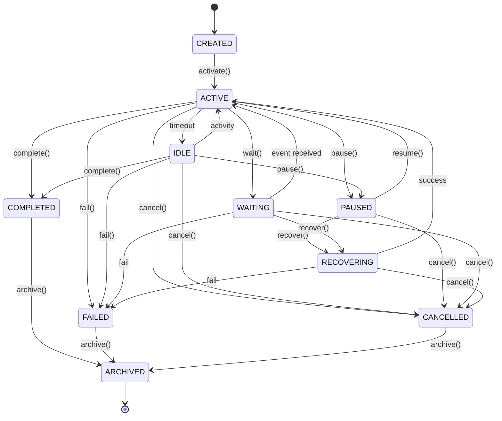
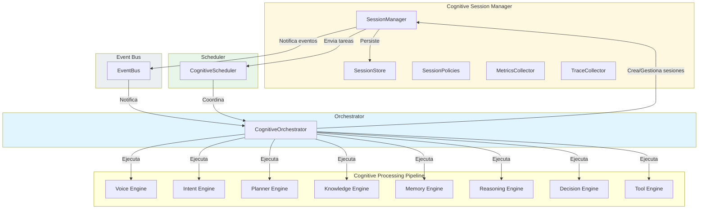

# Cognitive Session Manager — Arquitectura

> **Documento de arquitectura para el Cognitive Session Manager (CSM) de EREN.**
> El Session Manager gestiona el ciclo de vida logico de todas las sesiones cognitivas.

| | |
|---|---|
| **Estado** | Fundacion implementada |
| **Fase** | Cognitiva - Fase 2 |
| **Tipo** | Session Manager |
| **Paradigma** | EREN NO usa IA |

---

## Indice

- [1. Mision](#1-mision)
- [2. Filosofia](#2-filosofia)
- [3. Estados de Sesion](#3-estados-de-sesion)
- [4. Responsabilidades](#4-responsabilidades)
- [5. Integracion](#5-integracion)
- [6. Politicas](#6-politicas)
- [7. Trazabilidad](#7-trazabilidad)
- [8. Roadmap](#8-roadmap)

---

## 1. Mision

```
El Cognitive Session Manager gestiona el ciclo de vida logico de todas
las sesiones cognitivas.

NO ejecuta motores.
NO realiza razonamiento.
NO consulta memoria.
NO consulta conocimiento.
NO ejecuta herramientas.

Su unica responsabilidad es ADMINISTRAR SESIONES.
```

---

## 2. Filosofia

```
Separacion clara:
================

Session Manager (ESTE componente)
----------------------------------
- Crear y eliminar sesiones
- Gestionar estados de sesion
- Aplicar politicas de sesion
- Soportar multi-hospital
- Soportar multi-tenant

Motores (ejecutores)
----------------------------------
- Planner: Planifica
- Knowledge: Consulta conocimiento
- Memory: Consulta memoria
- Reasoning: Razo
- Decision: Decide
- Tool: Ejecuta

Infraestructura (dependencias)
----------------------------------
- Orchestrator: Coordinacion
- Scheduler: Planificacion
- EventBus: Comunicacion
```

---

## 3. Estados de Sesion

### 3.1 Diagrama de Estados



### 3.2 Estados Completos

| Estado | Descripcion | Estados Validos Siguientes |
|--------|-------------|---------------------------|
| CREATED | Sesion creada | ACTIVE, CANCELLED |
| ACTIVE | Sesion activa | IDLE, PAUSED, WAITING, COMPLETED, FAILED, CANCELLED |
| IDLE | Sesion inactiva | ACTIVE, PAUSED, COMPLETED, FAILED, CANCELLED |
| PAUSED | Sesion pausada | ACTIVE, RECOVERING, CANCELLED |
| WAITING | Esperando evento | ACTIVE, RECOVERING, FAILED, CANCELLED |
| RECOVERING | Recuperando | ACTIVE, FAILED, CANCELLED |
| COMPLETED | Sesion completada | ARCHIVED |
| FAILED | Sesion fallida | ARCHIVED |
| CANCELLED | Sesion cancelada | ARCHIVED |
| ARCHIVED | Sesion archivada | (terminal) |

---

## 4. Responsabilidades

### 4.1 Lo Que Hace el Session Manager

```
╔═══════════════════════════════════════════════════════════════════════════════╗
║                   RESPONSABILIDADES DEL SESSION MANAGER                      ║
╠═══════════════════════════════════════════════════════════════════════════════╣
║                                                                             ║
║  1. GESTION DE SESIONES                                                 ║
║     • Crear sesiones                                                     ║
║     • Buscar sesiones                                                    ║
║     • Recuperar sesiones                                                ║
║     • Pausar sesiones                                                   ║
║     • Reanudar sesiones                                                ║
║     • Cancelar sesiones                                                 ║
║     • Finalizar sesiones                                                ║
║     • Archivar sesiones                                                 ║
║     • Eliminar sesiones                                                 ║
║                                                                             ║
║  2. SEGUIMIENTO DE USO                                                 ║
║     • Registrar motores utilizados                                      ║
║     • Registrar capacidades ejecutadas                                   ║
║     • Contar iteraciones                                               ║
║     • Calcular tiempos                                                 ║
║                                                                             ║
║  3. POLITICAS DE SESION                                                 ║
║     • Aplicar timeouts                                                 ║
║     • Aplicar expiracion                                               ║
║     • Aplicar recuperacion                                             ║
║     • Aplicar archival                                                 ║
║     • Aplicar limpieza                                                 ║
║                                                                             ║
║  4. MULTI-HOSPITAL / MULTI-TENANT                                     ║
║     • Aislamiento por hospital                                        ║
║     • Aislamiento por tenant                                           ║
║     • Limites por organizacion                                         ║
║                                                                             ║
║  5. OBSERVABILIDAD                                                     ║
║     • Publicar eventos                                                 ║
║     • Recolectar metricas                                            ║
║     • Registrar traces                                                ║
║                                                                             ║
╚═══════════════════════════════════════════════════════════════════════════════╝
```

### 4.2 Lo Que NO Hace el Session Manager

```
╔═══════════════════════════════════════════════════════════════════════════════╗
║                  RESTRICCIONES DEL SESSION MANAGER                          ║
╠═══════════════════════════════════════════════════════════════════════════════╣
║                                                                             ║
║  ✗ NO ejecuta motores directos                                         ║
║  ✗ NO realiza razonamiento                                            ║
║  ✗ NO consulta memoria                                                ║
║  ✗ NO consulta conocimiento                                          ║
║  ✗ NO ejecuta herramientas                                          ║
║  ✗ NO implementa persistencia real                                   ║
║                                                                             ║
║  El Session Manager SOLO administra sesiones. No hace.              ║
║                                                                             ║
╚═══════════════════════════════════════════════════════════════════════════════╝
```

---

## 5. Integracion

### 5.1 Diagrama de Integracion



### 5.2 Flujo de Sesion

```
╔═══════════════════════════════════════════════════════════════════════════════╗
║                         FLUJO DE SESION                                     ║
╠═══════════════════════════════════════════════════════════════════════════════╣
║                                                                             ║
║  1. Usuario inicia interaccion                                        ║
║     ↓                                                                   ║
║  2. Orchestrator crea sesion via SessionManager                        ║
║     ↓                                                                   ║
║  3. SessionManager crea CognitiveSession                              ║
║     ↓                                                                   ║
║  4. SessionManager activa sesion                                      ║
║     ↓                                                                   ║
║  5. Scheduler coordina ejecucion de motores                          ║
║     ↓                                                                   ║
║  6. Motores ejecutan capacidades                                      ║
║     ↓                                                                   ║
║  7. SessionManager registra uso de motores                            ║
║     ↓                                                                   ║
║  8. Orchestrator completa o falla sesion                             ║
║     ↓                                                                   ║
║  9. SessionManager archiva sesion                                     ║
║     ↓                                                                   ║
║  10. Eventos publicados para observabilidad                            ║
║                                                                             ║
╚═══════════════════════════════════════════════════════════════════════════════╝
```

---

## 6. Politicas

### 6.1 Politicas Disponibles

| Politica | Descripcion | Valor Predeterminado |
|----------|------------|---------------------|
| session_timeout_ms | Timeout de sesion | 300000 (5 min) |
| idle_timeout_ms | Timeout de inactividad | 60000 (1 min) |
| max_session_duration_ms | Duracion maxima | 3600000 (1 hr) |
| max_recovery_attempts | Maximo recuperaciones | 3 |
| retention_days | Retention de sesiones | 90 dias |

### 6.2 Presets

```python
# Estandar
PolicyPresets.default()

# Estricto
PolicyPresets.strict()

# Desarrollo
PolicyPresets.permissive()

# Cumplimiento
PolicyPresets.compliance()
```

---

## 7. Trazabilidad

### 7.1 SessionTraceEntry

```python
@dataclass
class SessionTraceEntry:
    entry_id: str           # ID unico
    session_id: str       # ID de sesion
    correlation_id: str    # ID de correlacion
    timestamp: str        # Timestamp ISO
    action: str           # Accion
    session_state: str   # Estado de sesion
    previous_state: str | None  # Estado anterior
```

### 7.2 Acciones Rastreables

| Accion | Descripcion |
|--------|------------|
| CREATE | Sesion creada |
| ACTIVATE | Sesion activada |
| PAUSE | Sesion pausada |
| RESUME | Sesion reanudada |
| COMPLETE | Sesion completada |
| FAIL | Sesion fallida |
| CANCEL | Sesion cancelada |
| ARCHIVE | Sesion archivada |
| DELETE | Sesion eliminada |

---

## 8. Roadmap

### Fase 1: Fundacion (Actual)
```
- Core Session Manager
- Gestion de sesiones
- Estados y transiciones
- Politicas basicas
- Trazabilidad
```

### Fase 2: Persistencia
```
- Integracion con base de datos
- Persistencia de sesiones
- Replicacion
```

### Fase 3: Escalabilidad
```
- Particion de sesiones
- Balanceo de carga
- Cache de sesiones
```

### Fase 4: Compliance
```
- Retencion extendida
- Auditoria completa
- Cumplimiento regulatorio
```

---

## Referencias

| Referencia | Ubicacion |
|------------|-----------|
| Cognitive Orchestrator | [../core/orchestrator.md](./orchestrator.md) |
| Cognitive Scheduler | [../core/scheduler.md](./scheduler.md) |
| Cognitive Processing Pipeline | [../architecture/cognitive-processing-pipeline.md](../architecture/cognitive-processing-pipeline.md) |

---

**Ultima actualizacion:** 2026-07-13  
**Estado:** Fundacion implementada  
**Fase:** Cognitiva - Fase 2  
**Tipo:** Documentacion arquitectonica  
**Paradigma:** EREN NO usa IA