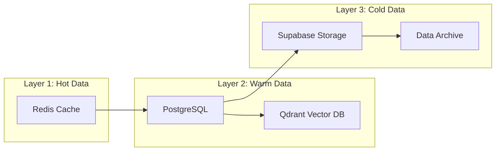
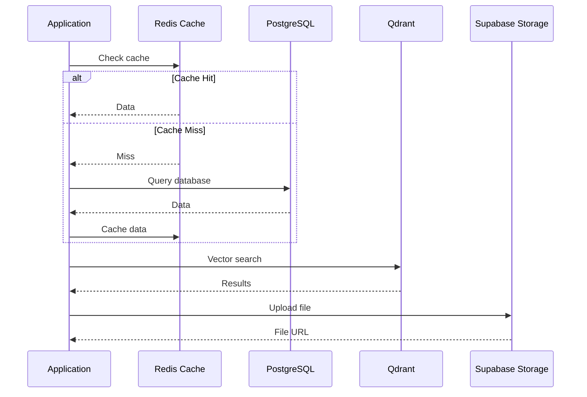

# Supabase Data Strategy

> **Estrategia de datos de Supabase para EREN Cognitive Operating System**

---

## Declaración de Propósito

Este documento define la estrategia de datos de Supabase para EREN, incluyendo arquitectura de base de datos, Row Level Security (RLS), multi-tenancy, backup, y migración.

**Alineado con**: VISION.md v1.0.0, TECH_BIBLE.md v2.0.0, ADR-0002

---

## Arquitectura de Datos

### Multi-Layer Storage Strategy



### Data Flow



---

## PostgreSQL Schema Strategy

### Database Design Principles

1. **Multi-Tenancy**: Cada hospital tiene sus datos aislados
2. **Row Level Security (RLS)**: Aislamiento a nivel de fila
3. **Audit Trail**: Toda modificación es auditada
4. **Soft Deletes**: Eliminación lógica en lugar de física
5. **Timestamps**: created_at y updated_at en todas las tablas
6. **UUID Primary Keys**: UUIDs en lugar de integers
7. **Foreign Keys**: Integridad referencial estricta

### Schema Organization

```sql
-- Schema principal (public)
-- Contiene todas las tablas de dominio

-- Schema de auditoría (audit)
-- Contiene tablas de auditoría

-- Schema de migraciones (migrations)
-- Contiene scripts de migración
```

### Core Tables

#### hospitals

```sql
CREATE TABLE hospitals (
    id UUID PRIMARY KEY DEFAULT gen_random_uuid(),
    code VARCHAR(50) UNIQUE NOT NULL,
    name VARCHAR(255) NOT NULL,
    address JSONB,
    contact_info JSONB,
    subscription_plan VARCHAR(50) NOT NULL,
    subscription_start_date DATE NOT NULL,
    subscription_end_date DATE,
    max_users INTEGER,
    max_equipment INTEGER,
    max_storage_gb INTEGER,
    timezone VARCHAR(50) DEFAULT 'UTC',
    language VARCHAR(10) DEFAULT 'en',
    currency VARCHAR(3) DEFAULT 'USD',
    status VARCHAR(20) DEFAULT 'active',
    configuration JSONB,
    created_at TIMESTAMP WITH TIME ZONE DEFAULT NOW(),
    updated_at TIMESTAMP WITH TIME ZONE DEFAULT NOW(),
    deleted_at TIMESTAMP WITH TIME ZONE
);

CREATE INDEX idx_hospitals_code ON hospitals(code);
CREATE INDEX idx_hospitals_status ON hospitals(status);
CREATE INDEX idx_hospitals_subscription ON hospitals(subscription_plan);
```

#### users

```sql
CREATE TABLE users (
    id UUID PRIMARY KEY DEFAULT gen_random_uuid(),
    hospital_id UUID NOT NULL REFERENCES hospitals(id) ON DELETE CASCADE,
    email VARCHAR(255) UNIQUE NOT NULL,
    username VARCHAR(100) UNIQUE NOT NULL,
    full_name VARCHAR(255),
    password_hash VARCHAR(255),
    roles JSONB NOT NULL,
    permissions JSONB NOT NULL,
    status VARCHAR(20) DEFAULT 'active',
    profile JSONB,
    last_login_at TIMESTAMP WITH TIME ZONE,
    created_at TIMESTAMP WITH TIME ZONE DEFAULT NOW(),
    updated_at TIMESTAMP WITH TIME ZONE DEFAULT NOW(),
    deleted_at TIMESTAMP WITH TIME ZONE
);

CREATE INDEX idx_users_hospital_id ON users(hospital_id);
CREATE INDEX idx_users_email ON users(email);
CREATE INDEX idx_users_username ON users(username);
CREATE INDEX idx_users_status ON users(status);
```

#### equipment

```sql
CREATE TABLE equipment (
    id UUID PRIMARY KEY DEFAULT gen_random_uuid(),
    hospital_id UUID NOT NULL REFERENCES hospitals(id) ON DELETE CASCADE,
    serial_number VARCHAR(100) UNIQUE NOT NULL,
    model VARCHAR(255) NOT NULL,
    manufacturer VARCHAR(255) NOT NULL,
    category VARCHAR(50) NOT NULL,
    location JSONB,
    status VARCHAR(20) DEFAULT 'active',
    acquisition_date DATE,
    warranty_expiry_date DATE,
    specifications JSONB,
    maintenance_history JSONB,
    current_assignment JSONB,
    created_at TIMESTAMP WITH TIME ZONE DEFAULT NOW(),
    updated_at TIMESTAMP WITH TIME ZONE DEFAULT NOW(),
    deleted_at TIMESTAMP WITH TIME ZONE
);

CREATE INDEX idx_equipment_hospital_id ON equipment(hospital_id);
CREATE INDEX idx_equipment_serial_number ON equipment(serial_number);
CREATE INDEX idx_equipment_category ON equipment(category);
CREATE INDEX idx_equipment_status ON equipment(status);
CREATE INDEX idx_equipment_location ON equipment USING GIN(location);
```

#### maintenance_orders

```sql
CREATE TABLE maintenance_orders (
    id UUID PRIMARY KEY DEFAULT gen_random_uuid(),
    hospital_id UUID NOT NULL REFERENCES hospitals(id) ON DELETE CASCADE,
    equipment_id UUID NOT NULL REFERENCES equipment(id) ON DELETE CASCADE,
    type VARCHAR(50) NOT NULL,
    priority VARCHAR(20) NOT NULL,
    status VARCHAR(20) DEFAULT 'pending',
    assigned_to UUID REFERENCES users(id) ON DELETE SET NULL,
    scheduled_date DATE,
    started_at TIMESTAMP WITH TIME ZONE,
    completed_at TIMESTAMP WITH TIME ZONE,
    description TEXT NOT NULL,
    symptoms JSONB,
    diagnosis JSONB,
    solution JSONB,
    parts_used JSONB,
    labor_hours DECIMAL(10, 2),
    cost DECIMAL(15, 2),
    quality_check JSONB,
    created_at TIMESTAMP WITH TIME ZONE DEFAULT NOW(),
    updated_at TIMESTAMP WITH TIME ZONE DEFAULT NOW(),
    deleted_at TIMESTAMP WITH TIME ZONE
);

CREATE INDEX idx_maintenance_orders_hospital_id ON maintenance_orders(hospital_id);
CREATE INDEX idx_maintenance_orders_equipment_id ON maintenance_orders(equipment_id);
CREATE INDEX idx_maintenance_orders_assigned_to ON maintenance_orders(assigned_to);
CREATE INDEX idx_maintenance_orders_status ON maintenance_orders(status);
CREATE INDEX idx_maintenance_orders_priority ON maintenance_orders(priority);
CREATE INDEX idx_maintenance_orders_scheduled_date ON maintenance_orders(scheduled_date);
```

#### cases

```sql
CREATE TABLE cases (
    id UUID PRIMARY KEY DEFAULT gen_random_uuid(),
    hospital_id UUID NOT NULL REFERENCES hospitals(id) ON DELETE CASCADE,
    equipment_id UUID NOT NULL REFERENCES equipment(id) ON DELETE CASCADE,
    title VARCHAR(255) NOT NULL,
    description TEXT NOT NULL,
    symptoms JSONB,
    diagnosis JSONB,
    solution JSONB,
    resolution JSONB,
    outcome VARCHAR(20),
    lessons_learned JSONB,
    tags JSONB,
    similarity_score DECIMAL(5, 4),
    created_by UUID REFERENCES users(id) ON DELETE SET NULL,
    is_anonymous BOOLEAN DEFAULT FALSE,
    is_verified BOOLEAN DEFAULT FALSE,
    verification_count INTEGER DEFAULT 0,
    created_at TIMESTAMP WITH TIME ZONE DEFAULT NOW(),
    updated_at TIMESTAMP WITH TIME ZONE DEFAULT NOW(),
    deleted_at TIMESTAMP WITH TIME ZONE
);

CREATE INDEX idx_cases_hospital_id ON cases(hospital_id);
CREATE INDEX idx_cases_equipment_id ON cases(equipment_id);
CREATE INDEX idx_cases_tags ON cases USING GIN(tags);
CREATE INDEX idx_cases_is_verified ON cases(is_verified);
CREATE INDEX idx_cases_similarity_score ON cases(similarity_score);
```

#### knowledge_items

```sql
CREATE TABLE knowledge_items (
    id UUID PRIMARY KEY DEFAULT gen_random_uuid(),
    title VARCHAR(255) NOT NULL,
    content TEXT NOT NULL,
    type VARCHAR(50) NOT NULL,
    source VARCHAR(500),
    equipment_models JSONB,
    category VARCHAR(100),
    tags JSONB,
    embedding VECTOR(1536),
    confidence DECIMAL(5, 4),
    last_validated TIMESTAMP WITH TIME ZONE,
    created_at TIMESTAMP WITH TIME ZONE DEFAULT NOW(),
    updated_at TIMESTAMP WITH TIME ZONE DEFAULT NOW(),
    metadata JSONB,
    version INTEGER DEFAULT 1,
    is_active BOOLEAN DEFAULT TRUE
);

CREATE INDEX idx_knowledge_items_type ON knowledge_items(type);
CREATE INDEX idx_knowledge_items_category ON knowledge_items(category);
CREATE INDEX idx_knowledge_items_tags ON knowledge_items USING GIN(tags);
CREATE INDEX idx_knowledge_items_embedding ON knowledge_items USING IVFFlat(embedding vector_cosine_ops);
CREATE INDEX idx_knowledge_items_is_active ON knowledge_items(is_active);
```

---

## Row Level Security (RLS)

### RLS Strategy

**Principio**: Aislamiento completo de datos por hospital.

```sql
-- Habilitar RLS en todas las tablas
ALTER TABLE hospitals ENABLE ROW LEVEL SECURITY;
ALTER TABLE users ENABLE ROW LEVEL SECURITY;
ALTER TABLE equipment ENABLE ROW LEVEL SECURITY;
ALTER TABLE maintenance_orders ENABLE ROW LEVEL SECURITY;
ALTER TABLE cases ENABLE ROW LEVEL SECURITY;
```

### RLS Policies

#### hospitals RLS

```sql
-- Solo usuarios del hospital pueden ver su hospital
CREATE POLICY "Users can view their hospital" ON hospitals
    FOR SELECT
    USING (
        id IN (
            SELECT hospital_id FROM users WHERE id = auth.uid()
        )
    );

-- Solo admins pueden modificar hospitales
CREATE POLICY "Admins can update hospitals" ON hospitals
    FOR UPDATE
    USING (
        EXISTS (
            SELECT 1 FROM users 
            WHERE id = auth.uid() 
            AND roles::jsonb ? 'admin'
        )
    );
```

#### users RLS

```sql
-- Usuarios solo pueden ver usuarios de su hospital
CREATE POLICY "Users can view hospital users" ON users
    FOR SELECT
    USING (
        hospital_id IN (
            SELECT hospital_id FROM users WHERE id = auth.uid()
        )
    );

-- Usuarios solo pueden ver su propio perfil
CREATE POLICY "Users can view own profile" ON users
    FOR SELECT
    USING (id = auth.uid());

-- Admins pueden crear usuarios en su hospital
CREATE POLICY "Admins can create users" ON users
    FOR INSERT
    WITH CHECK (
        hospital_id IN (
            SELECT hospital_id FROM users WHERE id = auth.uid()
        )
        AND EXISTS (
            SELECT 1 FROM users 
            WHERE id = auth.uid() 
            AND roles::jsonb ? 'admin'
        )
    );
```

#### equipment RLS

```sql
-- Usuarios solo pueden ver equipos de su hospital
CREATE POLICY "Users can view hospital equipment" ON equipment
    FOR SELECT
    USING (
        hospital_id IN (
            SELECT hospital_id FROM users WHERE id = auth.uid()
        )
    );

-- Técnicos pueden crear órdenes de mantenimiento
CREATE POLICY "Technicians can create maintenance orders" ON maintenance_orders
    FOR INSERT
    WITH CHECK (
        hospital_id IN (
            SELECT hospital_id FROM users WHERE id = auth.uid()
        )
        AND EXISTS (
            SELECT 1 FROM users 
            WHERE id = auth.uid() 
            AND roles::jsonb ? 'technician'
        )
    );
```

#### cases RLS

```sql
-- Usuarios solo pueden ver casos de su hospital
CREATE POLICY "Users can view hospital cases" ON cases
    FOR SELECT
    USING (
        hospital_id IN (
            SELECT hospital_id FROM users WHERE id = auth.uid()
        )
    );

-- Casos anónimos pueden ser vistos por todos (si configurado)
CREATE POLICY "Anonymous cases can be viewed" ON cases
    FOR SELECT
    USING (
        is_anonymous = TRUE
        AND EXISTS (
            SELECT 1 FROM hospitals 
            WHERE id = cases.hospital_id 
            AND configuration->>'share_anonymous_cases' = 'true'
        )
    );
```

---

## Multi-Tenancy Strategy

### Tenant Isolation

**Nivel de Aislamiento**: Row-level isolation

```sql
-- Todas las tablas tienen hospital_id
-- RLS asegura que usuarios solo ven datos de su hospital

-- Función helper para obtener hospital_id del usuario
CREATE OR REPLACE FUNCTION get_current_hospital_id()
RETURNS UUID AS $$
    SELECT hospital_id FROM users WHERE id = auth.uid();
$$ LANGUAGE SQL SECURITY DEFINER;
```

### Tenant Configuration

```sql
-- Configuración por hospital en tabla hospitals
ALTER TABLE hospitals ADD COLUMN configuration JSONB DEFAULT '{}'::jsonb;

-- Ejemplo de configuración
{
    "share_anonymous_cases": false,
    "allow_cross_hospital_search": false,
    "custom_fields": {
        "equipment": ["custom_field_1", "custom_field_2"],
        "maintenance": ["custom_field_3"]
    },
    "integrations": {
        "hl7": {"enabled": false, "endpoint": ""},
        "dicom": {"enabled": false, "endpoint": ""}
    }
}
```

---

## Backup Strategy

### Backup Types

**Automated Backups**:
- Daily backups: Retención 7 días
- Weekly backups: Retención 4 semanas
- Monthly backups: Retención 12 meses

**Point-in-Time Recovery (PITR)**:
- Habilitado para recuperación granular
- Retención 30 días

### Backup Schedule

```sql
-- Supabase maneja backups automáticamente
-- Configurar en dashboard de Supabase:
-- - Daily backups: 2 AM UTC
-- - Weekly backups: Domingo 2 AM UTC
-- - Monthly backups: 1er del mes 2 AM UTC
```

### Disaster Recovery

**RTO (Recovery Time Objective)**: 4 horas
**RPO (Recovery Point Objective)**: 15 minutos

**Procedimiento**:
1. Identificar último backup válido
2. Restaurar backup en staging
3. Validar integridad de datos
4. Restaurar en producción
5. Verificar funcionalidad

---

## Migration Strategy

### Migration Framework

Usar Supabase Migrations:

```bash
# Crear nueva migración
supabase migration new create_equipment_table

# Aplicar migraciones
supabase db push

# Revertir migración
supabase db reset
```

### Migration Naming Convention

```
YYYYMMDDHHMMSS_description.sql

Ejemplo:
20260710120000_create_hospitals_table.sql
20260710120001_create_users_table.sql
20260710120002_create_equipment_table.sql
```

### Migration Best Practices

1. **Idempotent**: Migraciones deben ser idempotentes
2. **Reversible**: Migraciones deben tener rollback
3. **Tested**: Migraciones testeadas en staging
4. **Documented**: Migraciones documentadas
5. **Backed Up**: Backup antes de migración

---

## Data Retention Policy

### Retention by Data Type

**Operational Data**:
- Maintenance orders: 7 años
- Cases: 10 años
- Equipment records: Lifetime

**Audit Data**:
- Audit logs: 5 años
- Access logs: 2 años

**User Data**:
- User profiles: Lifetime
- User sessions: 90 días

**Knowledge Data**:
- Knowledge items: Lifetime
- Embeddings: Lifetime

### Data Archival

```sql
-- Tabla de archivado
CREATE TABLE archived_data (
    id UUID PRIMARY KEY DEFAULT gen_random_uuid(),
    table_name VARCHAR(100) NOT NULL,
    record_id UUID NOT NULL,
    data JSONB NOT NULL,
    archived_at TIMESTAMP WITH TIME ZONE DEFAULT NOW(),
    archived_by UUID REFERENCES users(id)
);

-- Proceso de archivado
-- Mover datos antiguos a archived_data
-- Eliminar de tabla original
```

---

## Performance Optimization

### Indexing Strategy

**Primary Keys**: UUIDs con índices B-tree
**Foreign Keys**: Índices en todas las FKs
**Query Patterns**: Índices basados en queries frecuentes
**Full-text Search**: Índices GIN para JSONB
**Vector Search**: Índices IVFFlat para embeddings

### Query Optimization

```sql
-- Usar EXPLAIN ANALYZE para analizar queries
EXPLAIN ANALYZE SELECT * FROM equipment WHERE hospital_id = 'xxx';

-- Usar connection pooling
-- Configurar PgBouncer en Supabase

-- Usar prepared statements
-- Reducir overhead de parsing
```

### Caching Strategy

**Redis Cache**:
- Cachear resultados frecuentes
- TTL de 5-15 minutos
- Invalidar en actualizaciones

**Query Cache**:
- Cachear queries complejos
- TTL de 1-5 minutos
- Invalidar en cambios de datos

---

## Security Strategy

### Encryption

**At Rest**:
- Supabase encripta datos en reposo (AES-256)
- Encryption managed por Supabase

**In Transit**:
- TLS 1.3 para todas las conexiones
- Certificados SSL automáticos

**Field-Level Encryption**:
- Datos sensibles encriptados a nivel de campo
- Usar pgcrypto extension

```sql
-- Habilitar pgcrypto
CREATE EXTENSION IF NOT EXISTS pgcrypto;

-- Encriptar datos
SELECT pgp_sym_encrypt('sensitive_data', 'encryption_key');
```

### Secrets Management

**Environment Variables**:
- Database URL
- Service role key
- JWT secret

**Supabase Secrets**:
- Nunca hardcodear secrets
- Usar Supabase dashboard para secrets
- Rotar secrets regularmente

---

## Monitoring and Observability

### Metrics

**Database Metrics**:
- Connection count
- Query latency
- Disk usage
- CPU usage
- Memory usage

**Business Metrics**:
- Active hospitals
- Active users
- Equipment count
- Maintenance orders count
- Cases count

### Logging

**Query Logging**:
- Log queries lentos (> 1s)
- Log queries fallidas
- Log queries de alta frecuencia

**Audit Logging**:
- Log todas las modificaciones
- Log accesos a datos sensibles
- Log cambios de configuración

---

## Migration Path from Supabase

### Exit Strategy

**Preparación para migración a PostgreSQL nativo**:

1. **Export Schema**:
   ```bash
   pg_dump --schema-only > schema.sql
   ```

2. **Export Data**:
   ```bash
   pg_dump --data-only > data.sql
   ```

3. **Migrate to Native PostgreSQL**:
   - Instalar PostgreSQL nativo
   - Importar schema
   - Importar datos
   - Configurar RLS manualmente
   - Configurar backups manualmente

### Vendor Lock-in Mitigation

**Estrategias**:
- Usar SQL estándar PostgreSQL
- Evitar Supabase-specific features
- Documentar Supabase dependencies
- Preparar scripts de migración

---

## Data Quality Strategy

### Validation

**Input Validation**:
- Validar en aplicación
- Validar en base de datos (constraints)
- Validar en RLS policies

**Data Integrity**:
- Foreign key constraints
- Unique constraints
- Check constraints
- Not null constraints

### Data Cleaning

**Scheduled Jobs**:
- Limpiar datos duplicados
- Limpiar datos huérfanos
- Limpiar datos inconsistentes

**Manual Review**:
- Revisión periódica de calidad
- Corrección de errores
- Mejora de procesos

---

## Scalability Strategy

### Horizontal Scaling

**Read Replicas**:
- Configurar read replicas en Supabase
- Distribuir queries de lectura
- Reducir carga en primary

**Connection Pooling**:
- Usar PgBouncer
- Limitar conexiones
- Optimizar uso de conexiones

### Vertical Scaling

**Resource Allocation**:
- Monitorear uso de recursos
- Escalar cuando necesario
- Optimizar queries antes de escalar

---

**Versión**: 1.0.0  
**Fecha**: 2026-07-10  
**Autor**: Chief Software Architect / Principal AI Engineer / CTO  
**Alineado con**: VISION.md v1.0.0, TECH_BIBLE.md v2.0.0, ADR-0002
