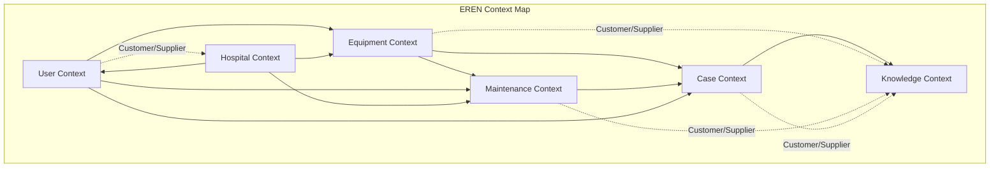
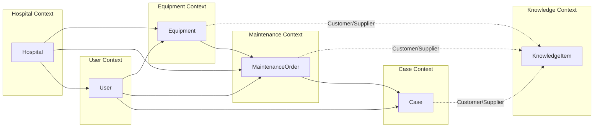

# Business Domains - Domain-Driven Design

> **Diseño de dominios de negocio de EREN usando Domain-Driven Design (DDD)**

---

## Declaración de Propósito

Este documento define los dominios de negocio de EREN usando Domain-Driven Design (DDD). Cada dominio representa un área de conocimiento específica de ingeniería clínica con sus propias entidades, value objects, aggregates, y domain services.

**Alineado con**: VISION.md v1.0.0, TECH_BIBLE.md v2.0.0, ADR-0002

---

## Context Map



### Relaciones Entre Contextos

- **Equipment Context**: Core context, dependiente de Knowledge Context
- **Maintenance Context**: Core context, dependiente de Equipment y Knowledge
- **Case Context**: Core context, dependiente de Equipment y Maintenance
- **Knowledge Context**: Supporting context, provee conocimiento a todos
- **User Context**: Generic context, usado por todos
- **Hospital Context**: Core context, configura multi-tenancy

---

## 1. Equipment Context

### Propósito

Gestionar el ciclo de vida completo de equipos médicos en un hospital.

### Bounded Context

El Equipment Context es responsable de:
- Registro de equipos médicos
- Gestión de inventario
- Seguimiento de ubicación
- Gestión de especificaciones técnicas
- Historial de mantenimiento
- Estado y disponibilidad

### Entities

#### Equipment (Entidad Raíz)

```python
class Equipment:
    """Entidad raíz del Equipment Context."""
    
    id: EquipmentId  # Identificador único
    serial_number: SerialNumber  # Número de serie
    model: EquipmentModel  # Modelo del equipo
    manufacturer: Manufacturer  # Fabricante
    category: EquipmentCategory  # Categoría (MRI, CT, X-Ray, etc.)
    location: Location  # Ubicación actual
    status: EquipmentStatus  # Estado (Active, Maintenance, Retired)
    acquisition_date: Date  # Fecha de adquisición
    warranty_expiry: Optional[Date]  # Fecha de expiración de garantía
    specifications: EquipmentSpecifications  # Especificaciones técnicas
    maintenance_history: List[MaintenanceRecord]  # Historial de mantenimiento
    current_assignment: Optional[Assignment]  # Asignación actual
```

### Value Objects

#### EquipmentId
```python
class EquipmentId:
    """Identificador único de equipo."""
    value: str
    
    def __init__(self, value: str):
        if not self._is_valid(value):
            raise InvalidEquipmentIdError(value)
        self.value = value
```

#### SerialNumber
```python
class SerialNumber:
    """Número de serie de equipo."""
    value: str
    
    def __init__(self, value: str):
        if not self._is_valid(value):
            raise InvalidSerialNumberError(value)
        self.value = value
```

#### EquipmentModel
```python
class EquipmentModel:
    """Modelo de equipo."""
    name: str
    manufacturer: Manufacturer
    specifications: EquipmentSpecifications
```

#### EquipmentCategory
```python
class EquipmentCategory(Enum):
    """Categoría de equipo médico."""
    IMAGING = "imaging"
    DIAGNOSTIC = "diagnostic"
    THERAPEUTIC = "therapeutic"
    MONITORING = "monitoring"
    LABORATORY = "laboratory"
    SUPPORT = "support"
```

#### EquipmentStatus
```python
class EquipmentStatus(Enum):
    """Estado de equipo."""
    ACTIVE = "active"
    IN_MAINTENANCE = "in_maintenance"
    OUT_OF_SERVICE = "out_of_service"
    RETIRED = "retired"
    DISPOSED = "disposed"
```

#### EquipmentSpecifications
```python
class EquipmentSpecifications:
    """Especificaciones técnicas de equipo."""
    power_requirements: PowerRequirements
    dimensions: Dimensions
    weight: Weight
    operating_conditions: OperatingConditions
    certifications: List[Certification]
    accessories: List[Accessory]
```

### Aggregates

#### Equipment Aggregate

**Raíz**: Equipment

**Entidades**:
- Equipment (raíz)
- MaintenanceRecord (entidad dentro del aggregate)
- Assignment (entidad dentro del aggregate)

**Value Objects**:
- EquipmentId
- SerialNumber
- EquipmentModel
- EquipmentCategory
- EquipmentStatus
- EquipmentSpecifications
- Location
- Manufacturer

**Invariants**:
- Un equipo solo puede tener un estado a la vez
- Un equipo solo puede estar en una ubicación a la vez
- El historial de mantenimiento es inmutable
- El número de serie es único

### Repositories

#### EquipmentRepository (Interface)

```python
class EquipmentRepository(ABC):
    """Repositorio de equipos."""
    
    @abstractmethod
    def save(self, equipment: Equipment) -> None:
        """Guarda un equipo."""
        pass
    
    @abstractmethod
    def find_by_id(self, equipment_id: EquipmentId) -> Optional[Equipment]:
        """Busca equipo por ID."""
        pass
    
    @abstractmethod
    def find_by_serial_number(self, serial_number: SerialNumber) -> Optional[Equipment]:
        """Busca equipo por número de serie."""
        pass
    
    @abstractmethod
    def find_by_hospital(self, hospital_id: HospitalId) -> List[Equipment]:
        """Busca equipos por hospital."""
        pass
    
    @abstractmethod
    def find_by_category(self, category: EquipmentCategory) -> List[Equipment]:
        """Busca equipos por categoría."""
        pass
    
    @abstractmethod
    def find_by_status(self, status: EquipmentStatus) -> List[Equipment]:
        """Busca equipos por estado."""
        pass
```

### Domain Services

#### EquipmentInventoryService

```python
class EquipmentInventoryService:
    """Servicio de dominio para gestión de inventario."""
    
    def __init__(self, equipment_repository: EquipmentRepository):
        self.equipment_repository = equipment_repository
    
    def check_availability(self, category: EquipmentCategory) -> int:
        """Verifica disponibilidad de equipos por categoría."""
        pass
    
    def calculate_depreciation(self, equipment: Equipment) -> Money:
        """Calcula depreciación de equipo."""
        pass
    
    def recommend_replacement(self, equipment: Equipment) -> bool:
        """Recomienda reemplazo de equipo."""
        pass
```

#### EquipmentLocationService

```python
class EquipmentLocationService:
    """Servicio de dominio para gestión de ubicaciones."""
    
    def __init__(self, equipment_repository: EquipmentRepository):
        self.equipment_repository = equipment_repository
    
    def track_movement(self, equipment: Equipment, new_location: Location) -> None:
        """Rastrea movimiento de equipo."""
        pass
    
    def verify_location(self, equipment: Equipment, location: Location) -> bool:
        """Verifica que equipo está en ubicación correcta."""
        pass
```

### Domain Events

#### EquipmentRegistered
```python
class EquipmentRegistered(DomainEvent):
    """Evento de dominio: equipo registrado."""
    equipment_id: EquipmentId
    serial_number: SerialNumber
    model: EquipmentModel
    occurred_at: datetime
```

#### EquipmentStatusChanged
```python
class EquipmentStatusChanged(DomainEvent):
    """Evento de dominio: estado de equipo cambiado."""
    equipment_id: EquipmentId
    old_status: EquipmentStatus
    new_status: EquipmentStatus
    occurred_at: datetime
```

#### EquipmentMoved
```python
class EquipmentMoved(DomainEvent):
    """Evento de dominio: equipo movido."""
    equipment_id: EquipmentId
    old_location: Location
    new_location: Location
    occurred_at: datetime
```

---

## 2. Maintenance Context

### Propósito

Gestionar procesos de mantenimiento preventivo y correctivo de equipos médicos.

### Bounded Context

El Maintenance Context es responsable de:
- Programación de mantenimiento preventivo
- Gestión de órdenes de mantenimiento
- Asignación de técnicos
- Seguimiento de progreso
- Validación de calidad
- Cierre de órdenes

### Entities

#### MaintenanceOrder (Entidad Raíz)

```python
class MaintenanceOrder:
    """Entidad raíz del Maintenance Context."""
    
    id: MaintenanceOrderId  # Identificador único
    equipment_id: EquipmentId  # ID de equipo
    type: MaintenanceType  # Tipo (Preventive, Corrective)
    priority: MaintenancePriority  # Prioridad
    status: MaintenanceStatus  # Estado
    assigned_to: Optional[TechnicianId]  # Técnico asignado
    scheduled_date: Optional[Date]  # Fecha programada
    started_at: Optional[DateTime]  # Fecha de inicio
    completed_at: Optional[DateTime]  # Fecha de completado
    description: str  # Descripción del problema
    symptoms: List[Symptom]  # Síntomas reportados
    diagnosis: Optional[Diagnosis]  # Diagnóstico
    solution: Optional[Solution]  # Solución aplicada
    parts_used: List[Part]  # Partes usadas
    labor_hours: Decimal  # Horas de trabajo
    cost: Money  # Costo total
    quality_check: Optional[QualityCheck]  # Verificación de calidad
```

### Value Objects

#### MaintenanceOrderId
```python
class MaintenanceOrderId:
    """Identificador único de orden de mantenimiento."""
    value: str
```

#### MaintenanceType
```python
class MaintenanceType(Enum):
    """Tipo de mantenimiento."""
    PREVENTIVE = "preventive"
    CORRECTIVE = "corrective"
    EMERGENCY = "emergency"
    CALIBRATION = "calibration"
    INSPECTION = "inspection"
```

#### MaintenancePriority
```python
class MaintenancePriority(Enum):
    """Prioridad de mantenimiento."""
    CRITICAL = "critical"
    HIGH = "high"
    MEDIUM = "medium"
    LOW = "low"
```

#### MaintenanceStatus
```python
class MaintenanceStatus(Enum):
    """Estado de mantenimiento."""
    PENDING = "pending"
    ASSIGNED = "assigned"
    IN_PROGRESS = "in_progress"
    COMPLETED = "completed"
    CANCELLED = "cancelled"
    ON_HOLD = "on_hold"
```

#### Symptom
```python
class Symptom:
    """Síntoma reportado."""
    description: str
    severity: SymptomSeverity
    reported_at: DateTime
    reported_by: UserId
```

#### Diagnosis
```python
class Diagnosis:
    """Diagnóstico técnico."""
    problem: str
    root_cause: str
    confidence: float  # 0-1
    suggested_solutions: List[Solution]
    estimated_cost: Money
    estimated_duration: Duration
```

#### Solution
```python
class Solution:
    """Solución aplicada."""
    description: str
    steps: List[str]
    parts_required: List[Part]
    estimated_duration: Duration
    actual_duration: Duration
    success: bool
```

### Aggregates

#### MaintenanceOrder Aggregate

**Raíz**: MaintenanceOrder

**Entidades**:
- MaintenanceOrder (raíz)
- QualityCheck (entidad dentro del aggregate)

**Value Objects**:
- MaintenanceOrderId
- MaintenanceType
- MaintenancePriority
- MaintenanceStatus
- Symptom
- Diagnosis
- Solution
- Part
- QualityCheck

**Invariants**:
- Una orden solo puede tener un estado a la vez
- Una orden solo puede estar asignada a un técnico a la vez
- El diagnóstico debe tener confidence > 0.5 para proceder
- La solución debe ser validada antes de cerrar la orden

### Repositories

#### MaintenanceOrderRepository (Interface)

```python
class MaintenanceOrderRepository(ABC):
    """Repositorio de órdenes de mantenimiento."""
    
    @abstractmethod
    def save(self, order: MaintenanceOrder) -> None:
        """Guarda una orden de mantenimiento."""
        pass
    
    @abstractmethod
    def find_by_id(self, order_id: MaintenanceOrderId) -> Optional[MaintenanceOrder]:
        """Busca orden por ID."""
        pass
    
    @abstractmethod
    def find_by_equipment(self, equipment_id: EquipmentId) -> List[MaintenanceOrder]:
        """Busca órdenes por equipo."""
        pass
    
    @abstractmethod
    def find_by_technician(self, technician_id: TechnicianId) -> List[MaintenanceOrder]:
        """Busca órdenes por técnico."""
        pass
    
    @abstractmethod
    def find_by_status(self, status: MaintenanceStatus) -> List[MaintenanceOrder]:
        """Busca órdenes por estado."""
        pass
    
    @abstractmethod
    def find_pending_by_priority(self, priority: MaintenancePriority) -> List[MaintenanceOrder]:
        """Busca órdenes pendientes por prioridad."""
        pass
```

### Domain Services

#### MaintenanceSchedulingService

```python
class MaintenanceSchedulingService:
    """Servicio de dominio para programación de mantenimiento."""
    
    def __init__(self, maintenance_repository: MaintenanceOrderRepository):
        self.maintenance_repository = maintenance_repository
    
    def schedule_preventive(self, equipment: Equipment, interval: Duration) -> MaintenanceOrder:
        """Programa mantenimiento preventivo."""
        pass
    
    def optimize_schedule(self, orders: List[MaintenanceOrder]) -> List[MaintenanceOrder]:
        """Optimiza programación de órdenes."""
        pass
    
    def check_conflicts(self, order: MaintenanceOrder) -> bool:
        """Verifica conflictos en programación."""
        pass
```

#### MaintenanceAssignmentService

```python
class MaintenanceAssignmentService:
    """Servicio de dominio para asignación de técnicos."""
    
    def __init__(self, technician_repository: TechnicianRepository):
        self.technician_repository = technician_repository
    
    def assign_technician(self, order: MaintenanceOrder) -> TechnicianId:
        """Asigna técnico a orden."""
        pass
    
    def find_available_technician(self, required_skills: List[Skill]) -> Optional[TechnicianId]:
        """Busca técnico disponible con habilidades requeridas."""
        pass
    
    def calculate_workload(self, technician_id: TechnicianId) -> Workload:
        """Calcula carga de trabajo de técnico."""
        pass
```

### Domain Events

#### MaintenanceOrderCreated
```python
class MaintenanceOrderCreated(DomainEvent):
    """Evento de dominio: orden de mantenimiento creada."""
    order_id: MaintenanceOrderId
    equipment_id: EquipmentId
    type: MaintenanceType
    priority: MaintenancePriority
    occurred_at: datetime
```

#### MaintenanceOrderAssigned
```python
class MaintenanceOrderAssigned(DomainEvent):
    """Evento de dominio: orden asignada a técnico."""
    order_id: MaintenanceOrderId
    technician_id: TechnicianId
    occurred_at: datetime
```

#### MaintenanceOrderCompleted
```python
class MaintenanceOrderCompleted(DomainEvent):
    """Evento de dominio: orden completada."""
    order_id: MaintenanceOrderId
    equipment_id: EquipmentId
    duration: Duration
    cost: Money
    occurred_at: datetime
```

---

## 3. Case Context

### Propósito

Gestionar casos de resolución de problemas técnicos como conocimiento institucional.

### Bounded Context

El Case Context es responsable de:
- Registro de casos resueltos
- Indexación de casos
- Búsqueda de casos similares
- Validación de casos
- Clasificación de casos
- Anonimización de datos sensibles

### Entities

#### Case (Entidad Raíz)

```python
class Case:
    """Entidad raíz del Case Context."""
    
    id: CaseId  # Identificador único
    equipment_id: EquipmentId  # ID de equipo
    title: str  # Título del caso
    description: str  # Descripción del problema
    symptoms: List[Symptom]  # Síntomas
    diagnosis: Diagnosis  # Diagnóstico
    solution: Solution  # Solución
    resolution: Resolution  # Resolución
    outcome: CaseOutcome  # Outcome
    lessons_learned: List[str]  # Lecciones aprendidas
    tags: List[Tag]  # Tags para clasificación
    similarity_score: Optional[float]  # Score de similitud
    created_by: UserId  # Usuario que creó el caso
    created_at: DateTime  # Fecha de creación
    updated_at: DateTime  # Fecha de actualización
    is_anonymous: bool  # Si está anonimizado
    is_verified: bool  # Si está verificado
    verification_count: int  # Número de verificaciones
```

### Value Objects

#### CaseId
```python
class CaseId:
    """Identificador único de caso."""
    value: str
```

#### Resolution
```python
class Resolution:
    """Resolución del caso."""
    steps: List[str]
    time_taken: Duration
    difficulty: Difficulty
    success_rate: float
```

#### CaseOutcome
```python
class CaseOutcome(Enum):
    """Outcome del caso."""
    RESOLVED = "resolved"
    PARTIALLY_RESOLVED = "partially_resolved"
    NOT_RESOLVED = "not_resolved"
    ESCALATED = "escalated"
```

#### Difficulty
```python
class Difficulty(Enum):
    """Dificultad de resolución."""
    TRIVIAL = "trivial"
    EASY = "easy"
    MEDIUM = "medium"
    HARD = "hard"
    EXPERT = "expert"
```

### Aggregates

#### Case Aggregate

**Raíz**: Case

**Entidades**:
- Case (raíz)

**Value Objects**:
- CaseId
- Symptom
- Diagnosis
- Solution
- Resolution
- CaseOutcome
- Difficulty
- Tag

**Invariants**:
- Un caso debe tener al menos un síntoma
- Un caso debe tener un diagnóstico
- Un caso debe tener una solución
- Un caso verificado debe tener verification_count >= 3

### Repositories

#### CaseRepository (Interface)

```python
class CaseRepository(ABC):
    """Repositorio de casos."""
    
    @abstractmethod
    def save(self, case: Case) -> None:
        """Guarda un caso."""
        pass
    
    @abstractmethod
    def find_by_id(self, case_id: CaseId) -> Optional[Case]:
        """Busca caso por ID."""
        pass
    
    @abstractmethod
    def find_by_equipment(self, equipment_id: EquipmentId) -> List[Case]:
        """Busca casos por equipo."""
        pass
    
    @abstractmethod
    def find_similar(self, symptoms: List[Symptom], limit: int) -> List[Case]:
        """Busca casos similares."""
        pass
    
    @abstractmethod
    def find_by_tags(self, tags: List[Tag]) -> List[Case]:
        """Busca casos por tags."""
        pass
    
    @abstractmethod
    def find_verified(self) -> List[Case]:
        """Busca casos verificados."""
        pass
```

### Domain Services

#### CaseSimilarityService

```python
class CaseSimilarityService:
    """Servicio de dominio para búsqueda de casos similares."""
    
    def __init__(self, case_repository: CaseRepository):
        self.case_repository = case_repository
    
    def find_similar_cases(self, symptoms: List[Symptom], limit: int = 10) -> List[Case]:
        """Busca casos similares por síntomas."""
        pass
    
    def calculate_similarity(self, case1: Case, case2: Case) -> float:
        """Calcula similitud entre dos casos."""
        pass
    
    def cluster_cases(self, cases: List[Case]) -> Dict[str, List[Case]]:
        """Clusteriza casos por similitud."""
        pass
```

#### CaseVerificationService

```python
class CaseVerificationService:
    """Servicio de dominio para verificación de casos."""
    
    def __init__(self, case_repository: CaseRepository):
        self.case_repository = case_repository
    
    def verify_case(self, case: Case, verifier: UserId) -> None:
        """Verifica un caso."""
        pass
    
    def is_verified(self, case: Case) -> bool:
        """Verifica si caso está verificado."""
        pass
    
    def mark_as_anonymous(self, case: Case) -> None:
        """Marca caso como anónimo."""
        pass
```

### Domain Events

#### CaseCreated
```python
class CaseCreated(DomainEvent):
    """Evento de dominio: caso creado."""
    case_id: CaseId
    equipment_id: EquipmentId
    created_by: UserId
    occurred_at: datetime
```

#### CaseVerified
```python
class CaseVerified(DomainEvent):
    """Evento de dominio: caso verificado."""
    case_id: CaseId
    verified_by: UserId
    verification_count: int
    occurred_at: datetime
```

---

## 4. Knowledge Context

### Propósito

Gestionar conocimiento técnico estructurado de ingeniería clínica.

### Bounded Context

El Knowledge Context es responsable de:
- Ingesta de conocimiento
- Indexación de conocimiento
- Búsqueda de conocimiento
- Validación de conocimiento
- Clasificación de conocimiento
- Versionado de conocimiento

### Entities

#### KnowledgeItem (Entidad Raíz)

```python
class KnowledgeItem:
    """Entidad raíz del Knowledge Context."""
    
    id: KnowledgeItemId  # Identificador único
    title: str  # Título
    content: str  # Contenido
    type: KnowledgeType  # Tipo de conocimiento
    source: str  # Fuente (URL, archivo)
    equipment_models: List[str]  # Modelos de equipo relacionados
    category: str  # Categoría
    tags: List[str]  # Tags
    embedding: List[float]  # Vector embedding
    confidence: float  # Nivel de confianza
    last_validated: datetime  # Fecha de última validación
    created_at: datetime  # Fecha de creación
    updated_at: datetime  # Fecha de actualización
    metadata: Dict[str, Any]  # Metadatos adicionales
    version: int  # Versión del conocimiento
    is_active: bool  # Si está activo
```

### Value Objects

#### KnowledgeItemId
```python
class KnowledgeItemId:
    """Identificador único de conocimiento."""
    value: str
```

#### KnowledgeType
```python
class KnowledgeType(Enum):
    """Tipo de conocimiento."""
    MANUAL = "manual"
    SPECIFICATION = "specification"
    PROCEDURE = "procedure"
    GUIDE = "guide"
    POLICY = "policy"
    REGULATION = "regulation"
    BEST_PRACTICE = "best_practice"
```

### Aggregates

#### KnowledgeItem Aggregate

**Raíz**: KnowledgeItem

**Entidades**:
- KnowledgeItem (raíz)

**Value Objects**:
- KnowledgeItemId
- KnowledgeType

**Invariants**:
- Un conocimiento debe tener confianza > 0.5
- Un conocimiento debe ser validado antes de ser activo
- Un conocimiento debe tener al menos un tag

### Repositories

#### KnowledgeRepository (Interface)

```python
class KnowledgeRepository(ABC):
    """Repositorio de conocimiento."""
    
    @abstractmethod
    def save(self, knowledge: KnowledgeItem) -> None:
        """Guarda conocimiento."""
        pass
    
    @abstractmethod
    def find_by_id(self, knowledge_id: KnowledgeItemId) -> Optional[KnowledgeItem]:
        """Busca conocimiento por ID."""
        pass
    
    @abstractmethod
    def search(self, query: str, filters: Dict[str, Any], limit: int) -> List[KnowledgeItem]:
        """Busca conocimiento."""
        pass
    
    @abstractmethod
    def find_by_equipment_model(self, model: str) -> List[KnowledgeItem]:
        """Busca conocimiento por modelo de equipo."""
        pass
    
    @abstractmethod
    def find_by_category(self, category: str) -> List[KnowledgeItem]:
        """Busca conocimiento por categoría."""
        pass
    
    @abstractmethod
    def find_active(self) -> List[KnowledgeItem]:
        """Busca conocimiento activo."""
        pass
```

### Domain Services

#### KnowledgeIngestionService

```python
class KnowledgeIngestionService:
    """Servicio de dominio para ingestión de conocimiento."""
    
    def __init__(self, knowledge_repository: KnowledgeRepository, embedding_service):
        self.knowledge_repository = knowledge_repository
        self.embedding_service = embedding_service
    
    def ingest_document(self, document: Document, metadata: Dict[str, Any]) -> KnowledgeItem:
        """Ingresa un documento."""
        pass
    
    def validate_knowledge(self, knowledge: KnowledgeItem) -> ValidationResult:
        """Valida conocimiento."""
        pass
    
    def generate_embedding(self, content: str) -> List[float]:
        """Genera embedding."""
        pass
```

#### KnowledgeSearchService

```python
class KnowledgeSearchService:
    """Servicio de dominio para búsqueda de conocimiento."""
    
    def __init__(self, knowledge_repository: KnowledgeRepository):
        self.knowledge_repository = knowledge_repository
    
    def search(self, query: str, filters: Dict[str, Any], limit: int = 10) -> List[KnowledgeItem]:
        """Busca conocimiento."""
        pass
    
    def search_hybrid(self, query: str, filters: Dict[str, Any], limit: int = 10) -> List[KnowledgeItem]:
        """Búsqueda híbrida (vectorial + keyword)."""
        pass
    
    def rerank(self, results: List[KnowledgeItem], query: str) -> List[KnowledgeItem]:
        """Reranking de resultados."""
        pass
```

### Domain Events

#### KnowledgeIngested
```python
class KnowledgeIngested(DomainEvent):
    """Evento de dominio: conocimiento ingestado."""
    knowledge_id: KnowledgeItemId
    type: KnowledgeType
    source: str
    occurred_at: datetime
```

#### KnowledgeValidated
```python
class KnowledgeValidated(DomainEvent):
    """Evento de dominio: conocimiento validado."""
    knowledge_id: KnowledgeItemId
    confidence: float
    validated_by: UserId
    occurred_at: datetime
```

---

## 5. User Context

### Propósito

Gestionar usuarios, roles y permisos del sistema.

### Bounded Context

El User Context es responsable de:
- Gestión de usuarios
- Gestión de roles
- Gestión de permisos
- Autenticación
- Autorización
- Auditoría de accesos

### Entities

#### User (Entidad Raíz)

```python
class User:
    """Entidad raíz del User Context."""
    
    id: UserId  # Identificador único
    email: Email  # Email
    username: Username  # Nombre de usuario
    full_name: str  # Nombre completo
    hospital_id: HospitalId  # ID de hospital
    roles: List[Role]  # Roles del usuario
    permissions: List[Permission]  # Permisos del usuario
    status: UserStatus  # Estado
    created_at: DateTime  # Fecha de creación
    last_login: Optional[DateTime]  # Último login
    profile: UserProfile  # Perfil del usuario
```

### Value Objects

#### UserId
```python
class UserId:
    """Identificador único de usuario."""
    value: str
```

#### Email
```python
class Email:
    """Email de usuario."""
    value: str
    
    def __init__(self, value: str):
        if not self._is_valid(value):
            raise InvalidEmailError(value)
        self.value = value
```

#### Username
```python
class Username:
    """Nombre de usuario."""
    value: str
```

#### UserStatus
```python
class UserStatus(Enum):
    """Estado de usuario."""
    ACTIVE = "active"
    INACTIVE = "inactive"
    SUSPENDED = "suspended"
    PENDING = "pending"
```

#### Role
```python
class Role:
    """Rol de usuario."""
    name: str
    permissions: List[Permission]
```

#### Permission
```python
class Permission:
    """Permiso de usuario."""
    resource: str
    action: str
    condition: Optional[str]
```

### Aggregates

#### User Aggregate

**Raíz**: User

**Entidades**:
- User (raíz)

**Value Objects**:
- UserId
- Email
- Username
- UserStatus
- Role
- Permission

**Invariants**:
- Un usuario debe tener al menos un rol
- Un usuario debe tener email único
- Un usuario debe tener username único
- Un usuario suspendido no puede hacer login

### Repositories

#### UserRepository (Interface)

```python
class UserRepository(ABC):
    """Repositorio de usuarios."""
    
    @abstractmethod
    def save(self, user: User) -> None:
        """Guarda usuario."""
        pass
    
    @abstractmethod
    def find_by_id(self, user_id: UserId) -> Optional[User]:
        """Busca usuario por ID."""
        pass
    
    @abstractmethod
    def find_by_email(self, email: Email) -> Optional[User]:
        """Busca usuario por email."""
        pass
    
    @abstractmethod
    def find_by_username(self, username: Username) -> Optional[User]:
        """Busca usuario por username."""
        pass
    
    @abstractmethod
    def find_by_hospital(self, hospital_id: HospitalId) -> List[User]:
        """Busca usuarios por hospital."""
        pass
    
    @abstractmethod
    def find_by_role(self, role: Role) -> List[User]:
        """Busca usuarios por rol."""
        pass
```

### Domain Services

#### AuthenticationService

```python
class AuthenticationService:
    """Servicio de dominio para autenticación."""
    
    def __init__(self, user_repository: UserRepository, password_hasher):
        self.user_repository = user_repository
        self.password_hasher = password_hasher
    
    def authenticate(self, email: Email, password: str) -> Optional[User]:
        """Autentica usuario."""
        pass
    
    def verify_token(self, token: str) -> Optional[UserId]:
        """Verifica token."""
        pass
    
    def generate_token(self, user: User) -> str:
        """Genera token."""
        pass
```

#### AuthorizationService

```python
class AuthorizationService:
    """Servicio de dominio para autorización."""
    
    def __init__(self, user_repository: UserRepository):
        self.user_repository = user_repository
    
    def has_permission(self, user: User, permission: Permission) -> bool:
        """Verifica si usuario tiene permiso."""
        pass
    
    def has_role(self, user: User, role: Role) -> bool:
        """Verifica si usuario tiene rol."""
        pass
    
    def check_access(self, user: User, resource: str, action: str) -> bool:
        """Verifica acceso a recurso."""
        pass
```

### Domain Events

#### UserCreated
```python
class UserCreated(DomainEvent):
    """Evento de dominio: usuario creado."""
    user_id: UserId
    email: Email
    hospital_id: HospitalId
    occurred_at: datetime
```

#### UserLoggedIn
```python
class UserLoggedIn(DomainEvent):
    """Evento de dominio: usuario hizo login."""
    user_id: UserId
    occurred_at: datetime
```

#### PermissionGranted
```python
class PermissionGranted(DomainEvent):
    """Evento de dominio: permiso otorgado."""
    user_id: UserId
    permission: Permission
    granted_by: UserId
    occurred_at: datetime
```

---

## 6. Hospital Context

### Propósito

Gestionar configuración multi-hospital y aislamiento de datos.

### Bounded Context

El Hospital Context es responsable de:
- Registro de hospitales
- Configuración por hospital
- Aislamiento de datos
- Gestión de suscripciones
- Configuración de límites
- Auditoría por hospital

### Entities

#### Hospital (Entidad Raíz)

```python
class Hospital:
    """Entidad raíz del Hospital Context."""
    
    id: HospitalId  # Identificador único
    name: str  # Nombre del hospital
    code: str  # Código del hospital
    address: Address  # Dirección
    contact: ContactInfo  # Información de contacto
    subscription: Subscription  # Suscripción
    configuration: HospitalConfiguration  # Configuración
    status: HospitalStatus  # Estado
    created_at: DateTime  # Fecha de creación
    updated_at: DateTime  # Fecha de actualización
```

### Value Objects

#### HospitalId
```python
class HospitalId:
    """Identificador único de hospital."""
    value: str
```

#### HospitalCode
```python
class HospitalCode:
    """Código de hospital."""
    value: str
```

#### HospitalStatus
```python
class HospitalStatus(Enum):
    """Estado de hospital."""
    ACTIVE = "active"
    INACTIVE = "inactive"
    SUSPENDED = "suspended"
    TRIAL = "trial"
```

#### Subscription
```python
class Subscription:
    """Suscripción de hospital."""
    plan: SubscriptionPlan
    start_date: Date
    end_date: Optional[Date]
    limits: SubscriptionLimits
    billing_info: BillingInfo
```

#### SubscriptionPlan
```python
class SubscriptionPlan(Enum):
    """Plan de suscripción."""
    BASIC = "basic"
    PROFESSIONAL = "professional"
    ENTERPRISE = "enterprise"
    CUSTOM = "custom"
```

#### SubscriptionLimits
```python
class SubscriptionLimits:
    """Límites de suscripción."""
    max_users: int
    max_equipment: int
    max_storage_gb: int
    max_api_calls_per_month: int
    max_concurrent_requests: int
```

#### HospitalConfiguration
```python
class HospitalConfiguration:
    """Configuración de hospital."""
    timezone: str
    language: str
    currency: str
    date_format: str
    custom_fields: Dict[str, Any]
    integrations: List[Integration]
    security_settings: SecuritySettings
```

### Aggregates

#### Hospital Aggregate

**Raíz**: Hospital

**Entidades**:
- Hospital (raíz)

**Value Objects**:
- HospitalId
- HospitalCode
- HospitalStatus
- Subscription
- SubscriptionPlan
- SubscriptionLimits
- HospitalConfiguration

**Invariants**:
- Un hospital debe tener código único
- Un hospital debe tener suscripción activa
- Un hospital no puede exceder límites de suscripción

### Repositories

#### HospitalRepository (Interface)

```python
class HospitalRepository(ABC):
    """Repositorio de hospitales."""
    
    @abstractmethod
    def save(self, hospital: Hospital) -> None:
        """Guarda hospital."""
        pass
    
    @abstractmethod
    def find_by_id(self, hospital_id: HospitalId) -> Optional[Hospital]:
        """Busca hospital por ID."""
        pass
    
    @abstractmethod
    def find_by_code(self, code: HospitalCode) -> Optional[Hospital]:
        """Busca hospital por código."""
        pass
    
    @abstractmethod
    def find_active(self) -> List[Hospital]:
        """Busca hospitales activos."""
        pass
    
    @abstractmethod
    def find_by_subscription(self, plan: SubscriptionPlan) -> List[Hospital]:
        """Busca hospitales por plan."""
        pass
```

### Domain Services

#### HospitalConfigurationService

```python
class HospitalConfigurationService:
    """Servicio de dominio para configuración de hospital."""
    
    def __init__(self, hospital_repository: HospitalRepository):
        self.hospital_repository = hospital_repository
    
    def update_configuration(self, hospital: Hospital, config: HospitalConfiguration) -> None:
        """Actualiza configuración de hospital."""
        pass
    
    def validate_configuration(self, config: HospitalConfiguration) -> ValidationResult:
        """Valida configuración."""
        pass
    
    def check_limits(self, hospital: Hospital) -> LimitStatus:
        """Verifica límites de suscripción."""
        pass
```

#### HospitalIsolationService

```python
class HospitalIsolationService:
    """Servicio de dominio para aislamiento de datos por hospital."""
    
    def __init__(self, hospital_repository: HospitalRepository):
        self.hospital_repository = hospital_repository
    
    def isolate_data(self, hospital_id: HospitalId) -> IsolationContext:
        """Crea contexto de aislamiento para hospital."""
        pass
    
    def verify_access(self, user: User, hospital_id: HospitalId) -> bool:
        """Verifica acceso de usuario a hospital."""
        pass
    
    def enforce_isolation(self, query: Any, hospital_id: HospitalId) -> Any:
        """Aplica aislamiento a query."""
        pass
```

### Domain Events

#### HospitalRegistered
```python
class HospitalRegistered(DomainEvent):
    """Evento de dominio: hospital registrado."""
    hospital_id: HospitalId
    name: str
    code: HospitalCode
    subscription_plan: SubscriptionPlan
    occurred_at: datetime
```

#### HospitalConfigurationUpdated
```python
class HospitalConfigurationUpdated(DomainEvent):
    """Evento de dominio: configuración de hospital actualizada."""
    hospital_id: HospitalId
    old_config: HospitalConfiguration
    new_config: HospitalConfiguration
    updated_by: UserId
    occurred_at: datetime
```

#### SubscriptionLimitReached
```python
class SubscriptionLimitReached(DomainEvent):
    """Evento de dominio: límite de suscripción alcanzado."""
    hospital_id: HospitalId
    limit_type: str
    current_value: int
    limit_value: int
    occurred_at: datetime
```

---

## Integración Entre Contextos

### Shared Kernel

**Shared Kernel** contiene elementos compartidos entre contextos:

- **Value Objects Comunes**: UserId, HospitalId, DateTime, Money
- **Domain Events Base**: DomainEvent base class
- **Exceptions Base**: DomainException base class
- **Interfaces Comunes**: Repository base interface

### Context Mapping



### Anti-Corruption Layer

Para integración con sistemas externos (HL7, DICOM, EMR/EHR), usar Anti-Corruption Layer:

```python
class HL7AntiCorruptionLayer:
    """Anti-Corruption Layer para HL7."""
    
    def convert_to_domain(self, hl7_message: HL7Message) -> DomainObject:
        """Convierte mensaje HL7 a objeto de dominio."""
        pass
    
    def convert_from_domain(self, domain_object: DomainObject) -> HL7Message:
        """Convierte objeto de dominio a mensaje HL7."""
        pass
```

---

## Estrategia de Implementación

### Fase 1: Core Contexts (v0.1.0 - v0.2.0)

**Contextos Prioritarios**:
1. Equipment Context
2. Maintenance Context
3. User Context
4. Hospital Context

### Fase 2: Supporting Contexts (v0.3.0 - v1.0.0)

**Contextos Secundarios**:
5. Case Context
6. Knowledge Context

### Fase 3: Advanced Features (v2.0.0+)

**Features Avanzadas**:
- Bounded Contexts adicionales
- Context Maps más complejos
- Integraciones profundas

---

## Testing Strategy

### Unit Tests

- Tests de entities
- Tests de value objects
- Tests de domain services
- Tests de repositories (con mocks)

### Integration Tests

- Tests de aggregates
- Tests de contextos completos
- Tests de integración entre contextos

### Domain Events Tests

- Tests de publicación de eventos
- Tests de manejo de eventos
- Tests de event sourcing

---

**Versión**: 1.0.0  
**Fecha**: 2026-07-10  
**Autor**: Chief Software Architect / Principal AI Engineer / CTO  
**Alineado con**: VISION.md v1.0.0, TECH_BIBLE.md v2.0.0, ADR-0002
