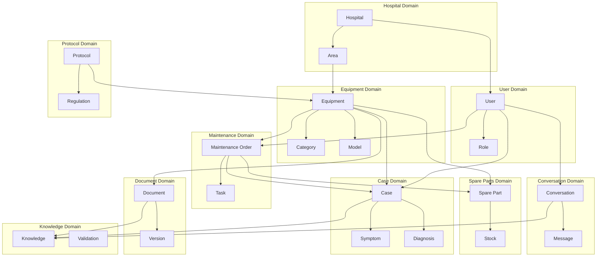

# Dominios de Negocio - EREN

> **Diseño de dominios siguiendo Domain Driven Design (DDD)**

---

## Tabla de Contenidos

1. [Visión General](#visión-general)
2. [Dominios Principales](#dominios-principales)
3. [Relaciones entre Dominios](#relaciones-entre-dominios)
4. [Bounded Contexts](#bounded-contexts)
5. [Entidades y Value Objects](#entidades-y-value-objects)
6. [Servicios de Dominio](#servicios-de-dominio)
7. [Eventos de Dominio](#eventos-de-dominio)

---

## Visión General

EREN opera en el dominio de **Ingeniería Clínica**, específicamente en la gestión de equipos médicos, mantenimiento, y conocimiento técnico. Los dominios están diseñados pensando como un ingeniero biomédico, no como tablas de base de datos.

### Principios de Diseño

1. **Ubiquitous Language**: Mismo lenguaje entre técnicos y desarrolladores
2. **Bounded Contexts**: Separación clara de contextos
3. **Aggregates**: Consistencia de datos dentro de límites
4. **Domain Events**: Comunicación asíncrona entre contextos
5. **Value Objects**: Inmutabilidad y sin identidad

---

## Dominios Principales

### 1. Dominio de Equipos (Equipment Domain)

**Propósito**: Gestión del ciclo de vida de equipos médicos

**Responsabilidades**:
- Registro de inventario
- Clasificación de equipos
- Seguimiento de ubicación
- Gestión de especificaciones técnicas
- Historial de mantenimiento
- Estado y disponibilidad

**Entidades**:
- `Equipment`: Equipo médico individual
- `EquipmentCategory`: Categoría de equipo
- `EquipmentModel`: Modelo específico
- `Manufacturer`: Fabricante

**Value Objects**:
- `SerialNumber`: Número de serie
- `AssetTag`: Etiqueta de activo
- `Specifications`: Especificaciones técnicas
- `Location`: Ubicación física
- `Status`: Estado del equipo

**Agregados**:
- `EquipmentAggregate`: Raíz es Equipment

**Servicios de Dominio**:
- `EquipmentClassificationService`: Clasificación automática
- `EquipmentLocationService`: Gestión de ubicaciones
- `EquipmentStatusService`: Gestión de estados

---

### 2. Dominio de Mantenimiento (Maintenance Domain)

**Propósito**: Gestión de órdenes de mantenimiento y reparaciones

**Responsabilidades**:
- Creación de órdenes de mantenimiento
- Asignación de técnicos
- Seguimiento de progreso
- Gestión de prioridades
- Programación preventiva
- Historial de reparaciones

**Entidades**:
- `MaintenanceOrder`: Orden de mantenimiento
- `MaintenanceTask`: Tarea específica
- `MaintenanceSchedule`: Programación
- `Technician`: Técnico asignado

**Value Objects**:
- `Priority`: Nivel de prioridad
- `Status`: Estado de la orden
- `EstimatedDuration`: Duración estimada
- `ActualDuration`: Duración real
- `Cost`: Costo de mantenimiento

**Agregados**:
- `MaintenanceOrderAggregate`: Raíz es MaintenanceOrder

**Servicios de Dominio**:
- `MaintenanceSchedulingService`: Programación de mantenimiento
- `MaintenanceAssignmentService`: Asignación de técnicos
- `MaintenancePriorityService`: Gestión de prioridades

---

### 3. Dominio de Casos (Case Domain)

**Propósito**: Gestión de casos de diagnóstico y resolución

**Responsabilidades**:
- Registro de síntomas
- Diagnóstico de fallas
- Registro de soluciones
- Análisis de patrones
- Búsqueda de casos similares
- Aprendizaje de casos

**Entidades**:
- `Case`: Caso de diagnóstico
- `Symptom`: Síntoma reportado
- `Diagnosis`: Diagnóstico realizado
- `Solution`: Solución aplicada
- `FailurePattern`: Patrón de falla

**Value Objects**:
- `SymptomDescription`: Descripción del síntoma
- `DiagnosisConfidence`: Confianza del diagnóstico
- `SolutionEffectiveness`: Efectividad de la solución
- `CaseSimilarity`: Similitud entre casos

**Agregados**:
- `CaseAggregate`: Raíz es Case

**Servicios de Dominio**:
- `CaseAnalysisService`: Análisis de casos
- `SimilaritySearchService`: Búsqueda de casos similares
- `PatternRecognitionService`: Reconocimiento de patrones

---

### 4. Dominio de Hospitales (Hospital Domain)

**Propósito**: Gestión multi-tenancy de hospitales

**Responsabilidades**:
- Registro de hospitales
- Aislamiento de datos
- Configuración por hospital
- Gestión de áreas/servicios
- Jerarquía organizacional

**Entidades**:
- `Hospital`: Hospital individual
- `HospitalArea`: Área/servicio
- `Department`: Departamento
- `OrganizationUnit`: Unidad organizacional

**Value Objects**:
- `HospitalCode`: Código de hospital
- `HospitalType`: Tipo de hospital
- `AreaType`: Tipo de área
- `ContactInfo`: Información de contacto

**Agregados**:
- `HospitalAggregate`: Raíz es Hospital

**Servicios de Dominio**:
- `HospitalIsolationService`: Aislamiento de datos
- `HospitalConfigurationService`: Configuración por hospital
- `OrganizationHierarchyService`: Gestión de jerarquía

---

### 5. Dominio de Usuarios (User Domain)

**Propósito**: Gestión de usuarios y permisos

**Responsabilidades**:
- Registro de usuarios
- Autenticación
- Autorización
- Gestión de roles
- Asignación de permisos
- Auditoría de accesos

**Entidades**:
- `User`: Usuario del sistema
- `Role`: Rol de usuario
- `Permission`: Permiso específico
- `UserSession`: Sesión de usuario

**Value Objects**:
- `Email`: Email de usuario
- `Credentials`: Credenciales de acceso
- `UserProfile`: Perfil de usuario
- `PermissionSet`: Conjunto de permisos

**Agregados**:
- `UserAggregate`: Raíz es User

**Servicios de Dominio**:
- `AuthenticationService`: Autenticación
- `AuthorizationService`: Autorización
- `RoleManagementService`: Gestión de roles

---

### 6. Dominio de Documentos (Document Domain)

**Propósito**: Gestión de documentación técnica

**Responsabilidades**:
- Almacenamiento de manuales
- Gestión de versiones
- Control de acceso
- Indexación de contenido
- Búsqueda de documentos
- Clasificación de documentos

**Entidades**:
- `Document`: Documento técnico
- `DocumentVersion`: Versión de documento
- `DocumentCategory`: Categoría de documento
- `DocumentTag`: Etiqueta de documento

**Value Objects**:
- `DocumentTitle`: Título de documento
- `DocumentType`: Tipo de documento
- `StoragePath`: Ruta de almacenamiento
- `DocumentMetadata`: Metadatos del documento

**Agregados**:
- `DocumentAggregate`: Raíz es Document

**Servicios de Dominio**:
- `DocumentVersioningService`: Gestión de versiones
- `DocumentIndexingService`: Indexación de contenido
- `DocumentAccessService`: Control de acceso

---

### 7. Dominio de Repuestos (Spare Parts Domain)

**Propósito**: Gestión de inventario de repuestos

**Responsabilidades**:
- Registro de repuestos
- Gestión de stock
- Pedidos de repuestos
- Asociaciones con equipos
- Proveedores
- Costos

**Entidades**:
- `SparePart`: Repuesto individual
- `PartCategory`: Categoría de repuesto
- `Supplier`: Proveedor
- `StockEntry`: Entrada de stock
- `PartAssociation`: Asociación equipo-repuesto

**Value Objects**:
- `PartNumber`: Número de parte
- `StockLevel`: Nivel de stock
- `ReorderPoint`: Punto de reorden
- `UnitCost`: Costo unitario

**Agregados**:
- `SparePartAggregate`: Raíz es SparePart

**Servicios de Dominio**:
- `InventoryManagementService`: Gestión de inventario
- `ProcurementService`: Gestión de compras
- `AssociationService`: Asociaciones equipo-repuesto

---

### 8. Dominio de Protocolos (Protocol Domain)

**Propósito**: Gestión de protocolos y normativas

**Responsabilidades**:
- Registro de protocolos
- Gestión de normativas
- Cumplimiento regulatorio
- Actualizaciones de protocolos
- Notificaciones de cambios
- Auditoría de cumplimiento

**Entidades**:
- `Protocol`: Protocolo específico
- `Regulation`: Normativa regulatoria
- `ComplianceRecord`: Registro de cumplimiento
- `ProtocolUpdate`: Actualización de protocolo

**Value Objects**:
- `ProtocolType`: Tipo de protocolo
- `RegulationCode`: Código de normativa
- `ComplianceStatus`: Estado de cumplimiento
- `EffectiveDate`: Fecha de vigencia

**Agregados**:
- `ProtocolAggregate`: Raíz es Protocol

**Servicios de Dominio**:
- `ComplianceMonitoringService`: Monitoreo de cumplimiento
- `ProtocolUpdateService`: Gestión de actualizaciones
- `RegulationTrackingService**: Seguimiento de normativas

---

### 9. Dominio de Conversaciones (Conversation Domain)

**Propósito**: Gestión de interacciones con EREN

**Responsabilidades**:
- Registro de conversaciones
- Contexto de usuario
- Historial de interacciones
- Feedback de usuarios
- Métricas de satisfacción
- Análisis de patrones de uso

**Entidades**:
- `Conversation`: Conversación individual
- `Message`: Mensaje en conversación
- `ConversationContext`: Contexto de conversación
- `UserFeedback`: Feedback de usuario

**Value Objects**:
- `MessageContent`: Contenido del mensaje
- `ConversationState`: Estado de conversación
- `SatisfactionScore**: Puntuación de satisfacción
- `InteractionPattern`: Patrón de interacción

**Agregados**:
- `ConversationAggregate`: Raíz es Conversation

**Servicios de Dominio**:
- `ContextManagementService`: Gestión de contexto
- `ConversationAnalysisService`: Análisis de conversaciones
- `FeedbackProcessingService`: Procesamiento de feedback

---

### 10. Dominio de Conocimiento (Knowledge Domain)

**Propósito**: Gestión del conocimiento técnico

**Responsabilidades**:
- Captura de conocimiento
- Organización de conocimiento
- Búsqueda de conocimiento
- Validación de conocimiento
- Actualización de conocimiento
- Distribución de conocimiento

**Entidades**:
- `KnowledgeItem`: Ítem de conocimiento
- `KnowledgeCategory`: Categoría de conocimiento
- `KnowledgeValidation`: Validación de conocimiento
- `KnowledgeUpdate`: Actualización de conocimiento

**Value Objects**:
- `KnowledgeType`: Tipo de conocimiento
- `ConfidenceLevel`: Nivel de confianza
- `Source`: Fuente de conocimiento
- `LastValidated`: Última validación

**Agregados**:
- `KnowledgeAggregate`: Raíz es KnowledgeItem

**Servicios de Dominio**:
- `KnowledgeCaptureService`: Captura de conocimiento
- `KnowledgeValidationService`: Validación de conocimiento
- `KnowledgeDistributionService`: Distribución de conocimiento

---

## Relaciones entre Dominios

### Diagrama de Relaciones



### Descripción de Relaciones

**Hospital → Equipment**
- Un hospital tiene múltiples equipos
- Un equipo pertenece a un hospital
- Relación: 1:N

**Hospital → User**
- Un hospital tiene múltiples usuarios
- Un usuario pertenece a un hospital
- Relación: 1:N

**Equipment → MaintenanceOrder**
- Un equipo tiene múltiples órdenes de mantenimiento
- Una orden de mantenimiento pertenece a un equipo
- Relación: 1:N

**Equipment → Case**
- Un equipo tiene múltiples casos
- Un caso pertenece a un equipo
- Relación: 1:N

**MaintenanceOrder → Case**
- Una orden de mantenimiento puede resolver un caso
- Un caso puede ser resuelto por una orden de mantenimiento
- Relación: 1:1 (opcional)

**User → MaintenanceOrder**
- Un usuario puede crear múltiples órdenes
- Una orden es creada por un usuario
- Relación: 1:N

**Case → Knowledge**
- Un caso contribuye al conocimiento
- El conocimiento se construye desde casos
- Relación: N:N

**Document → Knowledge**
- Un documento es fuente de conocimiento
- El conocimiento se extrae de documentos
- Relación: N:N

---

## Bounded Contexts

### Contexto de Gestión de Equipos (Equipment Management Context)

**Lenguaje Ubicuo**:
- Equipment, SerialNumber, AssetTag, Model, Manufacturer, Category, Location, Status

**Entidades**:
- Equipment (Aggregate Root)
- EquipmentCategory
- EquipmentModel
- Manufacturer

**Integración**:
- Publica eventos: EquipmentCreated, EquipmentUpdated, EquipmentMoved
- Consume eventos: MaintenanceCompleted, CaseResolved

---

### Contexto de Mantenimiento (Maintenance Context)

**Lenguaje Ubicuo**:
- MaintenanceOrder, Task, Technician, Priority, Status, Schedule, Preventive, Corrective

**Entidades**:
- MaintenanceOrder (Aggregate Root)
- MaintenanceTask
- MaintenanceSchedule
- Technician

**Integración**:
- Publica eventos: MaintenanceOrderCreated, MaintenanceCompleted, MaintenanceScheduled
- Consume eventos: EquipmentCreated, CaseCreated

---

### Contexto de Casos (Case Context)

**Lenguaje Ubicuo**:
- Case, Symptom, Diagnosis, Solution, Pattern, Similarity, Confidence

**Entidades**:
- Case (Aggregate Root)
- Symptom
- Diagnosis
- Solution
- FailurePattern

**Integración**:
- Publica eventos: CaseCreated, CaseResolved, PatternIdentified
- Consume eventos: MaintenanceCompleted, EquipmentUpdated

---

### Contexto de Hospital (Hospital Context)

**Lenguaje Ubicuo**:
- Hospital, Area, Department, OrganizationUnit, MultiTenancy, Isolation

**Entidades**:
- Hospital (Aggregate Root)
- HospitalArea
- Department
- OrganizationUnit

**Integración**:
- Publica eventos: HospitalCreated, HospitalUpdated
- Consume eventos: (ninguno - es contexto raíz)

---

### Contexto de Usuario (User Context)

**Lenguaje Ubicuo**:
- User, Role, Permission, Authentication, Authorization, Session, Profile

**Entidades**:
- User (Aggregate Root)
- Role
- Permission
- UserSession

**Integración**:
- Publica eventos: UserCreated, UserUpdated, PermissionChanged
- Consume eventos: HospitalCreated

---

### Contexto de Documentación (Documentation Context)

**Lenguaje Ubicuo**:
- Document, Version, Category, Tag, Storage, AccessControl, Indexing

**Entidades**:
- Document (Aggregate Root)
- DocumentVersion
- DocumentCategory
- DocumentTag

**Integración**:
- Publica eventos: DocumentUploaded, DocumentUpdated, VersionCreated
- Consume eventos: EquipmentCreated

---

### Contexto de Repuestos (Spare Parts Context)

**Lenguaje Ubicuo**:
- SparePart, Stock, Supplier, PartNumber, ReorderPoint, Procurement, Association

**Entidades**:
- SparePart (Aggregate Root)
- PartCategory
- Supplier
- StockEntry

**Integración**:
- Publica eventos: StockLow, PartProcured, AssociationCreated
- Consume eventos: EquipmentCreated, MaintenanceCompleted

---

### Contexto de Protocolos (Protocol Context)

**Lenguaje Ubicuo**:
- Protocol, Regulation, Compliance, Monitoring, Update, EffectiveDate

**Entidades**:
- Protocol (Aggregate Root)
- Regulation
- ComplianceRecord
- ProtocolUpdate

**Integración**:
- Publica eventos: ProtocolUpdated, ComplianceAlert, RegulationChanged
- Consume eventos: EquipmentCreated

---

### Contexto de Conversación (Conversation Context)

**Lenguaje Ubicuo**:
- Conversation, Message, Context, Feedback, Satisfaction, Pattern

**Entidades**:
- Conversation (Aggregate Root)
- Message
- ConversationContext
- UserFeedback

**Integración**:
- Publica eventos: ConversationStarted, MessageSent, FeedbackReceived
- Consume eventos: (ninguno - contexto de interacción)

---

### Contexto de Conocimiento (Knowledge Context)

**Lenguaje Ubicuo**:
- Knowledge, Validation, Confidence, Source, Capture, Distribution

**Entidades**:
- KnowledgeItem (Aggregate Root)
- KnowledgeCategory
- KnowledgeValidation
- KnowledgeUpdate

**Integración**:
- Publica eventos: KnowledgeCaptured, KnowledgeValidated, KnowledgeUpdated
- Consume eventos: CaseResolved, DocumentUploaded, ConversationCompleted

---

## Entidades y Value Objects

### Ejemplo: Equipment Aggregate

```python
# Entity
class Equipment(AggregateRoot):
    id: EquipmentId
    serial_number: SerialNumber  # Value Object
    asset_tag: AssetTag          # Value Object
    model: EquipmentModel        # Entity
    category: EquipmentCategory  # Entity
    location: Location           # Value Object
    status: EquipmentStatus      # Value Object
    specifications: Specifications  # Value Object
    hospital_id: HospitalId
    
    # Domain Events
    def move_to(self, new_location: Location) -> None:
        self.location = new_location
        self.record_event(EquipmentMoved(self.id, new_location))
    
    def mark_as_under_maintenance(self) -> None:
        self.status = EquipmentStatus.UNDER_MAINTENANCE
        self.record_event(EquipmentStatusChanged(self.id, self.status))

# Value Objects
@dataclass(frozen=True)
class SerialNumber:
    value: str
    
    def __post_init__(self):
        if not self._is_valid():
            raise InvalidSerialNumber(self.value)
    
    def _is_valid(self) -> bool:
        return len(self.value) >= 5 and self.value.isalnum()

@dataclass(frozen=True)
class Location:
    area: str
    room: str
    building: Optional[str]
    floor: Optional[int]
```

### Ejemplo: Maintenance Order Aggregate

```python
# Entity
class MaintenanceOrder(AggregateRoot):
    id: MaintenanceOrderId
    equipment_id: EquipmentId
    hospital_id: HospitalId
    assigned_to: Optional[UserId]
    priority: Priority          # Value Object
    status: MaintenanceStatus   # Value Object
    description: str
    tasks: List[MaintenanceTask]
    estimated_duration: Duration # Value Object
    actual_duration: Optional[Duration]
    
    # Domain Events
    def assign_to(self, technician: UserId) -> None:
        self.assigned_to = technician
        self.record_event(MaintenanceOrderAssigned(self.id, technician))
    
    def complete(self, actual_duration: Duration) -> None:
        self.status = MaintenanceStatus.COMPLETED
        self.actual_duration = actual_duration
        self.record_event(MaintenanceCompleted(self.id, actual_duration))

# Value Objects
@dataclass(frozen=True)
class Priority:
    level: PriorityLevel
    
    def is_higher_than(self, other: Priority) -> bool:
        return self.level.value > other.level.value

class PriorityLevel(Enum):
    HIGH = 3
    MEDIUM = 2
    LOW = 1
```

---

## Servicios de Dominio

### Ejemplo: Equipment Classification Service

```python
class EquipmentClassificationService(DomainService):
    def classify_equipment(
        self,
        manufacturer: str,
        model: str,
        specifications: Specifications
    ) -> EquipmentCategory:
        """Clasifica automáticamente un equipo según sus especificaciones."""
        
        if self._is_imaging_equipment(specifications):
            return EquipmentCategory.IMAGING
        elif self._is_monitoring_equipment(specifications):
            return EquipmentCategory.MONITORING
        elif self._is_surgical_equipment(specifications):
            return EquipmentCategory.SURGICAL
        else:
            return EquipmentCategory.GENERAL
    
    def _is_imaging_equipment(self, specs: Specifications) -> bool:
        return specs.has_modality() and specs.get_modality() in [
            "CT", "MRI", "XRAY", "ULTRASOUND"
        ]
```

### Ejemplo: Similarity Search Service

```python
class SimilaritySearchService(DomainService):
    def find_similar_cases(
        self,
        case: Case,
        threshold: float = 0.7
    ) -> List[Case]:
        """Encuentra casos similares basado en síntomas y diagnóstico."""
        
        symptom_vector = self._embed_symptoms(case.symptoms)
        similar_cases = self.case_repository.find_by_vector_similarity(
            symptom_vector,
            threshold=threshold
        )
        
        return similar_cases[:10]  # Top 10 casos similares
```

---

## Eventos de Dominio

### Eventos del Contexto de Equipos

```python
class EquipmentCreated(DomainEvent):
    equipment_id: EquipmentId
    hospital_id: HospitalId
    serial_number: SerialNumber
    model: str
    category: str

class EquipmentMoved(DomainEvent):
    equipment_id: EquipmentId
    old_location: Location
    new_location: Location

class EquipmentStatusChanged(DomainEvent):
    equipment_id: EquipmentId
    old_status: EquipmentStatus
    new_status: EquipmentStatus
```

### Eventos del Contexto de Mantenimiento

```python
class MaintenanceOrderCreated(DomainEvent):
    order_id: MaintenanceOrderId
    equipment_id: EquipmentId
    hospital_id: HospitalId
    priority: Priority

class MaintenanceCompleted(DomainEvent):
    order_id: MaintenanceOrderId
    equipment_id: EquipmentId
    duration: Duration
    technician_id: UserId

class MaintenanceScheduled(DomainEvent):
    order_id: MaintenanceOrderId
    scheduled_date: datetime
    equipment_id: EquipmentId
```

### Eventos del Contexto de Casos

```python
class CaseCreated(DomainEvent):
    case_id: CaseId
    equipment_id: EquipmentId
    hospital_id: HospitalId
    symptoms: List[Symptom]

class CaseResolved(DomainEvent):
    case_id: CaseId
    diagnosis: Diagnosis
    solution: Solution
    confidence: float

class PatternIdentified(DomainEvent):
    pattern_id: PatternId
    equipment_model: str
    failure_type: str
    frequency: int
```

---

## Resumen

Los dominios de negocio de EREN están diseñados siguiendo principios de DDD:

1. **Separación clara de contextos**: Cada bounded context tiene su lenguaje y responsabilidades
2. **Aggregates para consistencia**: Garantizan consistencia dentro de límites
3. **Value Objects para inmutabilidad**: Evitan efectos secundarios
4. **Domain Events para comunicación**: Desacoplamiento entre contextos
5. **Domain Services para lógica compleja**: Lógica que no pertenece a entidades

Esta estructura permite que EREN escale horizontalmente, mantenga consistencia de datos, y evolucione sin romper el dominio de negocio.

---

**Última actualización**: 2026-07-10
**Autor**: Lead Architect (Cascade)
**Versión**: 1.0.0
