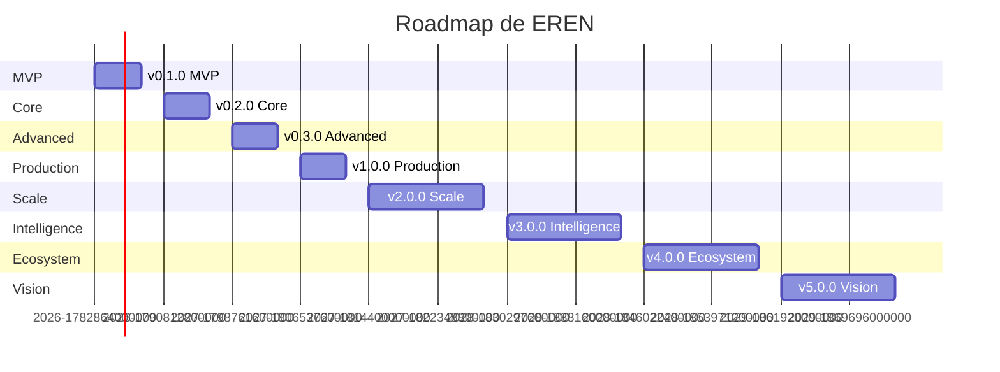

# Roadmap Completo de EREN

> **Planificación estratégica desde v0.1.0 hasta v5.0**

---

## Tabla de Contenidos

1. [Visión General del Roadmap](#visión-general-del-roadmap)
2. [v0.1.0 - MVP](#v010---mvp)
3. [v0.2.0 - Core](#v020---core)
4. [v0.3.0 - Advanced](#v030---advanced)
5. [v1.0.0 - Production](#v100---production)
6. [v2.0.0 - Scale](#v200---scale)
7. [v3.0.0 - Intelligence](#v300---intelligence)
8. [v4.0.0 - Ecosystem](#v400---ecosystem)
9. [v5.0.0 - Vision](#v500---vision)
10. [Métricas de Éxito](#métricas-de-éxito)

---

## Visión General del Roadmap

### Timeline Resumido

### Estrategia de Versionado

- **v0.x.x**: Versiones de desarrollo y beta
- **v1.0.0**: Primera versión estable de producción
- **v2.x.x**: Escalabilidad y performance
- **v3.x.x**: Inteligencia artificial avanzada
- **v4.x.x**: Ecosistema y plugins
- **v5.x.x**: Visión completa y plataforma clínica

---

## v0.1.0 - MVP

**Período**: Q3 2026 (Julio - Septiembre)  
**Objetivo**: Validar concepto con funcionalidad básica

### Objetivos Principales

1. Validar la necesidad de EREN en hospitales piloto
2. Demostrar valor con 3 agentes especializados
3. Establecer arquitectura base escalable
4. Capturar conocimiento inicial

### Funcionalidades

#### Core
- ✅ Sistema de autenticación multi-hospital (Supabase Auth)
- ✅ Gestión básica de inventario de equipos
- ✅ Registro de órdenes de mantenimiento
- ✅ Sistema de casos resueltos (Case Base)
- ✅ Búsqueda vectorial de conocimiento técnico
- ✅ Agente orquestador básico

#### Agentes Especializados
- ✅ **Agente de Diagnóstico**: Análisis de síntomas y recomendación de soluciones
- ✅ **Agente de Documentación**: Búsqueda y recuperación de manuales técnicos
- ✅ **Agente de Historia**: Análisis de casos similares y patrones

#### Conocimiento
- ✅ **Knowledge Base**: Manuales técnicos y documentación (ingesta manual)
- ✅ **Case Base**: Casos de mantenimiento resueltos (captura manual)
- ✅ **Memory Base**: Memoria de conversaciones y contexto
- ✅ **Document Base**: Protocolos y normativas básicas

#### Infraestructura
- ✅ Backend FastAPI con arquitectura limpia
- ✅ Frontend Next.js con TypeScript
- ✅ Base de datos Supabase (PostgreSQL)
- ✅ Vector database Qdrant
- ✅ Docker para contenedores
- ✅ Logging estructurado básico
- ✅ Tests unitarios básicos

### No Incluido

- ❌ Learning Base (aprendizaje automático)
- ❌ Agente de Predicción (mantenimiento predictivo)
- ❌ Agente de Compras (recomendación de repuestos)
- ❌ Multi-hospital colaborativo
- ❌ Integración con sistemas hospitalarios (HL7, DICOM)
- ❌ Móvil (app nativa)
- ❌ Análisis avanzado de datos
- ❌ CI/CD completo

### Métricas de Éxito

- 2 hospitales piloto activos
- 50+ usuarios activos
- 100+ casos registrados
- 70%+ satisfacción de usuarios
- < 5s tiempo de respuesta promedio

### Hitos

1. **Semana 1-2**: Configuración de infraestructura
2. **Semana 3-4**: Desarrollo de backend base
3. **Semana 5-6**: Desarrollo de frontend base
4. **Semana 7-8**: Implementación de agentes
5. **Semana 9-10**: Integración y testing
6. **Semana 11-12**: Deploy piloto y feedback

---

## v0.2.0 - Core

**Período**: Q4 2026 (Octubre - Diciembre)  
**Objetivo**: Completar funcionalidades core y mejorar UX

### Objetivos Principales

1. Completar sistema de conocimiento
2. Mejorar experiencia de usuario
3. Implementar Learning Base básica
4. Añadir Agente de Predicción

### Funcionalidades Nuevas

#### Conocimiento
- ✅ **Learning Base**: Aprendizaje automático básico
- ✅ Ingesta automática de documentos
- ✅ Validación de conocimiento
- ✅ Sistema de feedback de usuarios

#### Agentes
- ✅ **Agente de Predicción**: Predicción de fallas básica
- ✅ Mejoras en orquestador (más inteligente)
- ✅ Sistema de permisos granular

#### UX/UI
- ✅ Dashboard mejorado con métricas
- ✅ Búsqueda avanzada con filtros
- ✅ Visualización de casos similares
- ✅ Interfaz móvil responsiva

#### Infraestructura
- ✅ Redis para caching
- ✅ Celery para tareas async
- ✅ Mejoras en logging y observabilidad
- ✅ Tests de integración completos

### Mejoras

- 🔄 Optimización de búsqueda vectorial
- 🔄 Mejoras en performance de agentes
- 🔄 Explicabilidad mejorada de respuestas
- 🔄 Sistema de notificaciones

### Métricas de Éxito

- 5 hospitales activos
- 200+ usuarios activos
- 500+ casos registrados
- 80%+ satisfacción de usuarios
- < 3s tiempo de respuesta promedio
- 90%+ precisión de predicciones

### Hitos

1. **Octubre**: Learning Base y Agente de Predicción
2. **Noviembre**: Mejoras UX/UI y caching
3. **Diciembre**: Testing completo y optimización

---

## v0.3.0 - Advanced

**Período**: Q1 2027 (Enero - Marzo)  
**Objetivo**: Funcionalidades avanzadas e integraciones

### Objetivos Principales

1. Implementar Agente de Compras
2. Habilitar multi-hospital colaborativo (opcional)
3. Integración con sistemas hospitalarios básica
4. App web móvil

### Funcionalidades Nuevas

#### Agentes
- ✅ **Agente de Compras**: Recomendación de repuestos y proveedores
- ✅ Sistema de orquestación avanzado
- ✅ Agentes con memoria distribuida

#### Integraciones
- ✅ Integración HL7 básica (ADT, ORM)
- ✅ Integración DICOM básica (metadata)
- ✅ API pública para integraciones de terceros

#### Multi-Hospital
- ✅ Modo colaborativo (opcional por hospital)
- ✅ Compartición anónima de casos
- ✅ Benchmarking entre hospitales

#### Móvil
- ✅ App web móvil optimizada
- ✅ Notificaciones push
- ✅ Offline mode básico

### Mejoras

- 🔄 Sistema de knowledge graphs
- 🔄 Búsqueda híbrida mejorada
- 🔄 Reranking de resultados
- 🔄 Sistema de recomendaciones proactivas

### Métricas de Éxito

- 10 hospitales activos
- 500+ usuarios activos
- 2,000+ casos registrados
- 85%+ satisfacción de usuarios
- < 2s tiempo de respuesta promedio
- 95%+ precisión de predicciones

### Hitos

1. **Enero**: Agente de Compras e integraciones
2. **Febrero**: Multi-hospital colaborativo
3. **Marzo**: App móvil y optimización

---

## v1.0.0 - Production

**Período**: Q2 2027 (Abril - Junio)  
**Objetivo**: Primera versión estable de producción

### Objetivos Principales

1. Estabilidad y robustez completa
2. Documentación exhaustiva
3. Soporte enterprise
4. CI/CD completo

### Funcionalidades

#### Estabilidad
- ✅ 99.9% uptime SLA
- ✅ Disaster recovery completo
- ✅ Backup automático y restauración
- ✅ Monitoring y alertas completas

#### Documentación
- ✅ Documentación de API completa (OpenAPI)
- ✅ Guías de usuario detalladas
- ✅ Guías de administración
- ✅ Guías de integración
- ✅ Videos tutoriales

#### Soporte
- ✅ Soporte 24/7 enterprise
- ✅ SLAs definidos
- ✅ Account managers
- ✅ Training programs

#### CI/CD
- ✅ Pipeline completo con GitHub Actions
- ✅ Automated testing (unit, integration, E2E)
- ✅ Automated deployment
- ✅ Rollback automático
- ✅ Security scanning

### Métricas de Éxito

- 20+ hospitales en producción
- 1,000+ usuarios activos
- 10,000+ casos registrados
- 90%+ satisfacción de usuarios
- < 1s tiempo de respuesta promedio
- 99.9% uptime

### Hitos

1. **Abril**: Hardening y disaster recovery
2. **Mayo**: Documentación y soporte
3. **Junio**: CI/CD y release v1.0.0

---

## v2.0.0 - Scale

**Período**: Q3-Q4 2027 (Julio - Diciembre)  
**Objetivo**: Escalabilidad horizontal y análisis avanzado

### Objetivos Principales

1. Escalabilidad horizontal completa
2. Análisis avanzado de datos
3. App nativa móvil
4. Marketplace de módulos

### Funcionalidades Nuevas

#### Escalabilidad
- ✅ Kubernetes para orquestación
- ✅ Microservicios (separación de componentes críticos)
- ✅ Sharding de Qdrant
- ✅ Read replicas de PostgreSQL
- ✅ CDN global

#### Análisis
- ✅ Dashboards avanzados de analytics
- ✅ Reports personalizados
- ✅ Análisis de tendencias
- ✅ Predicciones de demanda
- ✅ Optimización de inventario

#### Móvil
- ✅ App nativa iOS
- ✅ App nativa Android
- ✅ Sincronización offline completa
- ✅ Push notifications inteligentes

#### Marketplace
- ✅ Marketplace de módulos de terceros
- ✅ API para desarrolladores
- ✅ SDK para integraciones
- ✅ Sistema de plugins

### Mejoras

- 🔄 Digital twins de equipos
- 🔄 Simulación de escenarios
- 🔄 Optimización de rutas de técnicos
- 🔄 Gamificación para usuarios

### Métricas de Éxito

- 50+ hospitales en producción
- 5,000+ usuarios activos
- 50,000+ casos registrados
- 92%+ satisfacción de usuarios
- < 500ms tiempo de respuesta promedio
- 99.95% uptime

### Hitos

1. **Q3 2027**: Escalabilidad y análisis
2. **Q4 2027**: Móvil nativo y marketplace

---

## v3.0.0 - Intelligence

**Período**: Q1-Q2 2028 (Enero - Junio)  
**Objetivo**: Inteligencia artificial avanzada y aprendizaje automático

### Objetivos Principales

1. Aprendizaje automático avanzado
2. Predicción de fallas precisa
3. Optimización automática de procesos
4. Digital twins completos

### Funcionalidades Nuevas

#### IA Avanzada
- ✅ Modelos de ML entrenados específicamente para ingeniería biomédica
- ✅ Predicción de fallas con 98%+ precisión
- ✅ Optimización automática de calendarios de mantenimiento
- ✅ Recomendaciones proactivas de repuestos
- ✅ Anomaly detection en tiempo real

#### Digital Twins
- ✅ Digital twins de equipos críticos
- ✅ Simulación de escenarios de falla
- ✅ Optimización de life cycle de equipos
- ✅ Análisis de cost-benefit de reemplazo

#### Procesos
- ✅ Automatización de workflows
- ✅ Rutas óptimas para técnicos
- ✅ Asignación inteligente de recursos
- ✅ Predicción de demanda de repuestos

### Mejoras

- 🔄 Modelos de lenguaje fine-tuned
- 🔄 Multi-modal AI (texto, imagen, audio)
- 🔄 Reinforcement learning para optimización
- 🔄 Federated learning para multi-hospital

### Métricas de Éxito

- 100+ hospitales en producción
- 20,000+ usuarios activos
- 200,000+ casos registrados
- 95%+ satisfacción de usuarios
- < 300ms tiempo de respuesta promedio
- 98%+ precisión de predicciones
- 99.99% uptime

### Hitos

1. **Q1 2028**: IA avanzada y digital twins
2. **Q2 2028**: Automatización y optimización

---

## v4.0.0 - Ecosystem

**Período**: Q3-Q4 2028 (Julio - Diciembre)  
**Objetivo**: Ecosistema abierto y plataforma de investigación

### Objetivos Principales

1. API pública completa
2. Plugins de terceros
3. Integración con EMR/EHR
4. Research platform

### Funcionalidades Nuevas

#### API Pública
- ✅ API REST completa
- ✅ API GraphQL
- ✅ Webhooks
- ✅ SDKs (Python, JavaScript, Java)
- ✅ Developer portal

#### Plugins
- ✅ Sistema de plugins robusto
- ✅ Marketplace de plugins verificados
- ✅ Plugins de terceros (integraciones, visualizaciones, etc.)
- ✅ Sandbox para desarrollo de plugins

#### EMR/EHR
- ✅ Integración con Epic
- ✅ Integración con Cerner
- ✅ Integración con Allscripts
- ✅ FHIR compliance
- ✅ Interoperabilidad completa

#### Research
- ✅ Platform de investigación biomédica
- ✅ Análisis de datos anonimizados
- ✅ Publicación de insights
- ✅ Colaboración con instituciones académicas

### Mejoras

- 🔄 Blockchain para trazabilidad de conocimiento
- 🔄 Smart contracts para acuerdos entre hospitales
- 🔄 DAO para gobernanza del ecosistema
- 🔄 Token economy para incentivos

### Métricas de Éxito

- 200+ hospitales en producción
- 50,000+ usuarios activos
- 1,000,000+ casos registrados
- 96%+ satisfacción de usuarios
- < 200ms tiempo de respuesta promedio
- 50+ plugins de terceros
- 99.99% uptime

### Hitos

1. **Q3 2028**: API pública y plugins
2. **Q4 2028**: EMR/EHR y research platform

---

## v5.0.0 - Vision

**Período**: Q1-Q2 2029 (Enero - Junio)  
**Objetivo**: Plataforma clínica completa y red de hospitales

### Objetivos Principales

1. Plataforma clínica completa
2. Soporte a decisiones médicas
3. Investigación biomédica avanzada
4. Red global de hospitales

### Funcionalidades Nuevas

#### Clínica
- ✅ Soporte a decisiones clínicas (CDS)
- ✅ Integración con dispositivos médicos IoT
- ✅ Telemedicina integrada
- ✅ Seguimiento de pacientes
- ✅ Alertas clínicas inteligentes

#### Investigación
- ✅ Platform de investigación clínica
- ✅ Ensayos clínicos digitales
- ✅ Análisis de datos de mundo real (RWD)
- ✅ Publicación automática de papers
- ✅ Colaboración global

#### Red
- ✅ Red global de hospitales EREN
- ✅ Compartición de conocimiento anonimizado
- ✅ Benchmarking global
- ✅ Best practices globales
- ✅ Community de práctica

### Visión Final

EREN se transforma de una herramienta de ingeniería biomédica a una plataforma integral que:

- Soporta todo el ciclo de vida de equipos médicos
- Proporciona soporte a decisiones clínicas
- Facilita investigación biomédica
- Conecta hospitales globalmente
- Mejora la seguridad del paciente a escala

### Métricas de Éxito

- 500+ hospitales en producción
- 200,000+ usuarios activos
- 10,000,000+ casos registrados
- 97%+ satisfacción de usuarios
- < 100ms tiempo de respuesta promedio
- 99.999% uptime
- Impacto medible en seguridad del paciente

### Hitos

1. **Q1 2029**: Plataforma clínica
2. **Q2 2029**: Red global y visión completa

---

## Métricas de Éxito

### Métricas de Producto

| Métrica | v0.1.0 | v0.2.0 | v0.3.0 | v1.0.0 | v2.0.0 | v3.0.0 | v4.0.0 | v5.0.0 |
|---------|--------|--------|--------|--------|--------|--------|--------|--------|
| Hospitales | 2 | 5 | 10 | 20 | 50 | 100 | 200 | 500 |
| Usuarios | 50 | 200 | 500 | 1,000 | 5,000 | 20,000 | 50,000 | 200,000 |
| Casos | 100 | 500 | 2,000 | 10,000 | 50,000 | 200,000 | 1,000,000 | 10,000,000 |
| Satisfacción | 70% | 80% | 85% | 90% | 92% | 95% | 96% | 97% |
| Tiempo Respuesta | < 5s | < 3s | < 2s | < 1s | < 500ms | < 300ms | < 200ms | < 100ms |
| Uptime | N/A | N/A | N/A | 99.9% | 99.95% | 99.99% | 99.99% | 99.999% |
| Precisión Predicciones | N/A | 90% | 95% | 95% | 96% | 98% | 98% | 99% |

### Métricas Técnicas

| Métrica | v0.1.0 | v0.2.0 | v0.3.0 | v1.0.0 | v2.0.0 | v3.0.0 | v4.0.0 | v5.0.0 |
|---------|--------|--------|--------|--------|--------|--------|--------|--------|
| Test Coverage | 60% | 70% | 80% | 90% | 95% | 95% | 95% | 95% |
| API Endpoints | 20 | 40 | 60 | 80 | 120 | 150 | 200 | 250 |
| Agentes | 3 | 4 | 5 | 6 | 10 | 15 | 20 | 25 |
| Integraciones | 0 | 2 | 5 | 10 | 20 | 30 | 50 | 100 |
| Plugins | 0 | 0 | 0 | 0 | 10 | 30 | 50 | 100 |

---

## Resumen

Este roadmap establece la evolución de EREN desde un MVP (v0.1.0) hasta una plataforma clínica completa (v5.0.0) en un período de 3 años.

### Fases Clave

1. **Validación (v0.1.0 - v0.2.0)**: Probar concepto y construir core
2. **Avance (v0.3.0 - v1.0.0)**: Funcionalidades avanzadas y estabilidad
3. **Escalado (v2.0.0 - v3.0.0)**: Escalabilidad e inteligencia avanzada
4. **Ecosistema (v4.0.0 - v5.0.0)**: Plataforma abierta y visión completa

### Principios

- **Iterativo**: Cada versión añade valor medible
- **Escalable**: Arquitectura preparada para crecer 100x
- **Responsable**: IA responsable en cada etapa
- **Centrado en Usuario**: Feedback drive desarrollo
- **Visionario**: Manteniendo la visión de plataforma clínica

Este roadmap es un documento vivo que se actualizará regularmente basado en feedback del mercado, avances tecnológicos, y necesidades de los usuarios.

---

**Última actualización**: 2026-07-10
**Autor**: Lead Architect (Cascade)
**Versión**: 1.0.0
**Próxima revisión**: v0.2.0 (Q4 2026)
